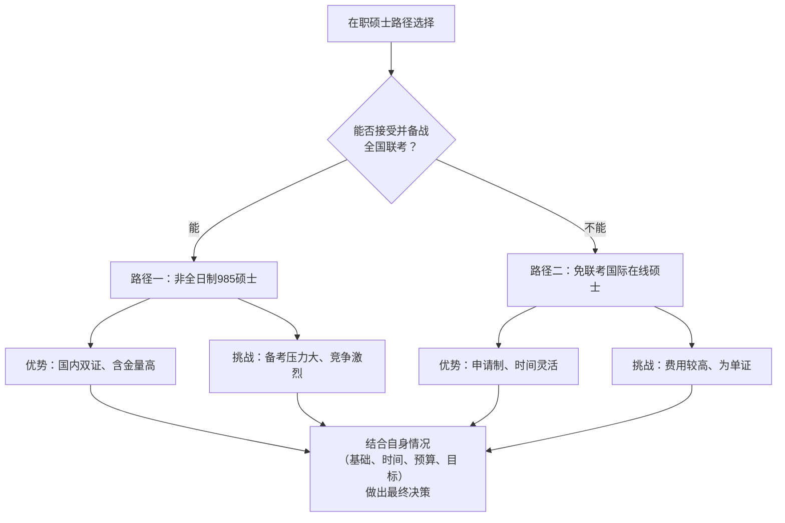

# 学校 题目优先

知识点、往年卷整理

从题目出发，并且最好解题方法和老师一样

笔记：你要的是希腊字母“Delta”，表示“变化量”。常见有：

- 大写：Δ（如 ΔU、ΔH、ΔG）
- 小写：δ（微小变化或偏差时常用）

下面是常用的输入方式：

- 在 Notion 里（推荐）
    - 行内数学：输入 $ΔU$ 或 $\Delta U$，回车即可显示 ΔU
    - 块级公式：/equation 新建公式块，输入 Delta
    - 直接粘贴字符：Δ 或 δ

GPT学习和研究状态是在需要探索、研究、创新的时候用，如果是学习已经有的知识直接问就好

[质量管理](质量管理%2034e0f8d8d1fd80fcb7b8e9fbff2f0ef6.md)

[项目管理](项目管理%202850f8d8d1fd8068ab9ada001bd0f7ca.md)

[工程化学](工程化学%202970f8d8d1fd803fac5af0adc93fa9aa.md)

[数字电路](数字电路%202970f8d8d1fd80f98c2eec31bbe1f6aa.md)

我完全理解你的顾虑。对于在职人员来说，时间和精力确实是最大的挑战。但请放心，攻读硕士学位并非只有辞职备考这一条“绝路”。

针对您“没时间”的核心痛点，这里有几个非常适合在职人士的解决方案：

### 1. 非全日制硕士：为在职者量身定制

这是最主流、最对口的选择。非全日制硕士的特点完美匹配在职人员：

- **上课时间**：通常在**周末**或**集中一段时间（如寒暑假）** 授课，完全不占用工作日。
- **档案与户口**：不调档案、不迁户口，不影响你现有的工作和生活状态。
- **学历学位**：毕业后可获得**硕士学历证书和学位证书**（双证），与全日制证书具有同等法律效力，在求职、晋升、考公考编时均被认可。

**一些开设软件工程非全日制硕士的985院校示例：**

| 院校名称 | 项目特点 |
| --- | --- |
| **北京航空航天大学** | 计算机学院、软件学院均有非全日制招生，师资强大，注重实践。 |
| **华中农业大学** | 信息学院招收软件工程非全日制硕士。 |
| **其他985院校** | 很多985高校都开设了非全日制的电子信息或软件工程类专业，你可以重点关注本省或邻近省份的985高校。 |

**行动建议**：立即搜索你所在或邻近城市的**985高校的研究生招生网**，查看“非全日制专业学位招生简章”，确认具体的招生专业、上课方式和考试科目。

### 2. 免联考国际硕士：另一种捷径

如果你觉得全国联考（研究生统一招生考试）压力太大，可以考虑免联考的海外大学在线硕士项目。

- **特点**：
    - **申请制入学**：无需参加全国联考，提交材料审核后即可入学。
    - **在线学习**：通过在线平台完成课程学习，时间和地点非常灵活。
    - **证书效力**：毕业后可获得海外院校的硕士学位证书，可用于提升专业能力、在外资企业或国际化企业求职。
- **提供院校示例**：美国亚利桑那大学、伊利诺伊理工大学、罗切斯特理工大学等均开设软件工程、计算机科学方向的在线硕士项目。

### 如何权衡选择：一张图看懂决策路径

为了帮助你更直观地做出选择，可以参考下面的决策流程图：

### 下一步行动建议

1. **明确你的核心目标**：你读这个硕士主要是为了**内部晋升**、**跳槽加分**还是**学习新知**？这决定了你对证书“含金量”的要求。
2. **评估自身基础与资源**：你的英语、数学和专业基础如何？你能投入的备考时间和预算是多少？
3. **主动搜集信息**：
    - 如果你对**非全日制985**感兴趣，现在就去查院校的招生简章。
    - 如果你对**免联考国际硕士**感兴趣，可以搜索“软件工程 在线硕士”了解详情。

总而言之，**在职绝不意味着与深造无缘**，只是需要你选择一条更适合自己当前生活节奏的路径。希望这些信息能帮你打开思路，找到那条属于你的进阶之路。如果需要针对某个具体方向了解更多，我们可以继续探讨。

[数据结构](数据结构%202d80f8d8d1fd804c9827e288802e15f6.md)