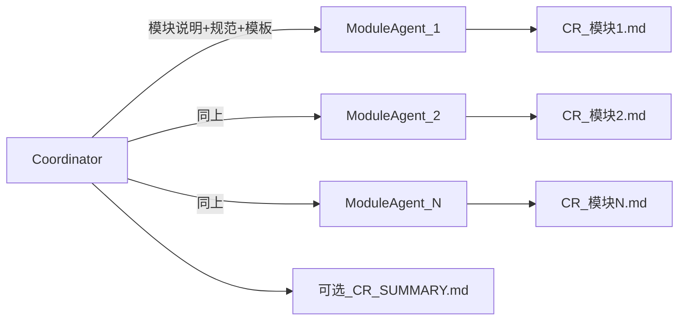

# 模块化AI CR

# AI Review

```
我希望对整个仓库进行 CR。目前的计划是分成几个模块，每个模块单独放一个子 agent 进行 CR。
最终的 CR 会产出多个 md 文档，每个文档对应一个模块。CR 的重点主要在代码的安全性/合规性/可维护性、可能存在的逻辑漏洞、代码编排方式等。
现在我需要你开始拟定这个计划。CR 的具体模块我会在后续的对话中给出。
```

plan 生成：

---

name: 全仓分模块 CR 计划
overview: 在不动代码的前提下，用「协调者 + 每模块一个子 Agent」并行产出多份 Markdown CR 报告；模块清单由你后续给出。本计划所称「安全」指 **页面展示与运行安全**（白屏、崩溃、卡死、无兜底等），**非**信息安全主线；并固定协作方式、审查维度、文档结构与收口方式。
todos:
- id: define-modules
content: 持续补充模块列表；已登记：AI 基建、构建改造、其余基建、Shared、Menu、兼容层与杂项、ShopInfo、OrderList、OrderDetail、OrderCardActionBar、OrderDetailComponents、PrintManage-打印机管理
status: in_progress
- id: setup-output-dir
content: 确认 CR 报告目录（如 docs/code-review/）与是否入库 / gitignore
status: pending
- id: coordinator-briefings
content: 协调者为每模块生成 briefing（范围、规则引用、输出文件名）
status: pending
- id: parallel-agents
content: 按依赖关系并行或串行启动子 Agent，按统一模板产出 CR_*.md
status: pending
- id: optional-summary
content: 可选：汇总 CR_SUMMARY.md（P0/P1 与跨模块重复项）
status: pending
isProject: false

---

## 全仓分模块 Code Review 执行计划

### 仓库现状（便于对齐范围）

```
- **根工作区**：`[pnpm-workspace.yaml](pnpm-workspace.yaml)` 包含 `shared`、`apps/ka-mop-toolkit` 等。
- **主应用**：`[apps/ka-mop-toolkit](apps/ka-mop-toolkit)` — 典型分层为 `src/apis`、`src/stores`、`src/pages`、`src/components`、`src/utils`、`src/types`、`src/constants` 等，且多处已有 `[module.mdc](apps/ka-mop-toolkit/.cursor/rules/module.mdc)` 约定。
- **共享包**：`[shared](shared)` — hooks、components、library（请求/桥等）、utils、types、bridges 等。
```

后续你给出的「模块」可以是：**物理目录**（如 `shared/library`）、**逻辑域**（如「订单全链路」跨 apis+stores+pages）、或 **横切主题**（安全/合规专项）；本流程三种都支持，只需在模块说明里写清 **路径边界** 与 **是否允许跨包引用**。

---

### 已登记模块

### 模块：AI 基建（Cursor / 助手工程化）

```
- **审查范围（仓库根）**：`[/.cursor/](.cursor/)` 下与助手相关的配置与脚本，当前包含：
	- `[/.cursor/rules/](.cursor/rules/)` — 项目级 `.mdc` 规则（MRN、Max、coding、module 更新约定等）
	- `[/.cursor/scripts/](.cursor/scripts/)` — MCP 等启动脚本（如 `start-*-mcp.sh`）
	- `[/.cursor/skills/module-mdc-audit-fix/](.cursor/skills/module-mdc-audit-fix/)` — `module.mdc` 巡检 Skill（`SKILL.md` 及同目录文件）
	- `[/.cursor/mcp.json](.cursor/mcp.json)` — MCP 服务与工具连接配置
- **明确排除（除非后续扩范围）**：各应用/包内嵌的 `.cursor`（如 `apps/**/.cursor`、`shared/**/.cursor`）归入对应业务模块 CR，**不**算在本模块内，避免与「页面/组件/module.mdc 业务说明」重复；若希望「全仓所有 .cursor」合并评审，需单独说明。
- **产出文件名建议**：`CR_ai-infra.md`（或 `CR_cursor-ai-infra.md`，全仓统一一种即可）。
```

**本子模块 CR 重点（在通用模板基础上强调）**

| 子路径 | 审查侧重点 |
| --- | --- |
| ``` |  |
| rules/*.mdc |  |

```
| ```
scripts/*
``` | 硬编码密钥/Token；未校验的路径或参数；`curl`/子进程/网络拉取的可执行内容风险；可维护性（注释、失败处理、与文档是否一致） |
| ```
skills/module-mdc-audit-fix
``` | Skill 描述与步骤是否可复现；是否误报/漏报；是否写入错误路径或破坏仓库；与 `[mdc-update.mdc](.cursor/rules/mdc-update.mdc)` 约定是否一致 |
| ```
mcp.json
``` | 启用的 MCP 是否最小必要；是否暴露本机敏感路径或过度权限；**报告中禁止粘贴** 疑似密钥或内网 URL 明文，用占位描述即可 |
**协调者下发给子 Agent 的 briefing（复制即用）**
	- **模块名**：AI 基建
	- **路径**：仅 `/.cursor/rules/`**、/.cursor/scripts/**、`/.cursor/skills/**`、`/.cursor/mcp.json`（以仓库根 `[ka-b](.)` 为准）
	- **必读**：先读 `[/.cursor/rules/mdc-update.mdc](.cursor/rules/mdc-update.mdc)` 与 `[/.cursor/rules/coding.mdc](.cursor/rules/coding.mdc)`，再按需读各 `rules/*.mdc`；`mcp.json` 与 `scripts/`* 做安全与可维护性专项
	- **交界**：业务目录内 `.cursor` 不在此模块；若发现规则引用业务路径，仅在「规则是否准确」层面点评，不深评业务实现
	- **输出**：按「单模块 CR 文档模板」写 `CR_ai-infra.md`（路径由协调者与「产出物约定」最终定稿）
#### 模块：构建改造（Metro / MRN 配置与 pnpm patch）

	- **审查范围**：
		- **ka-mop-toolkit 下 Metro/MRN**：`[apps/ka-mop-toolkit/metro.config.js](apps/ka-mop-toolkit/metro.config.js)`、`[apps/ka-mop-toolkit/metro.asset.plugin.js](apps/ka-mop-toolkit/metro.asset.plugin.js)`、`[apps/ka-mop-toolkit/mrn.config.js](apps/ka-mop-toolkit/mrn.config.js)`
		- **根目录依赖补丁**：`[patches/@max__create-cli-utils@2.0.4.patch](patches/@max__create-cli-utils@2.0.4.patch)`，并与根 `[package.json](package.json)` 中 `patchedDependencies`（`@max/create-cli-utils@2.0.4` → 该 patch 路径）对照，确认声明与文件一致、版本升级时是否易遗漏
	- **不包含（归属其它模块）**：`apps/ka-mop-toolkit` 下 `build.js`、`babel.config.js` 划入 **其余基建**，不在本模块评审。
	- **本模块独有**：`metro.config.js`、`metro.asset.plugin.js`、`mrn.config.js`（截图中的 `mm.config.js` 在本仓库为 `mrn.config.js`）；根 `patches/`** 及根 `package.json` 中 `patchedDependencies` 与 patch 的对应关系。
	- **产出文件名建议**：`CR_build-transform.md`。
**本子模块 CR 重点（在通用模板基础上强调）**
| 子项 | 审查侧重点 |
| --- | --- |
| `metro.config.js` / `metro.asset.plugin.js` | 自定义 resolver、transformer、watchFolders 是否引入路径穿越或意外暴露本机目录；对 node_modules / monorepo 软链的处理是否清晰；与 `shared` 等 workspace 包的引用是否稳定；性能与可维护性（注释、魔法路径集中配置） |
| ```
mrn.config.js
``` | 与 Metro/MRN 官方或团队约定是否一致；bundle 分包、入口、环境变量注入等是否可追溯；升级 MRN/Max 时的回归风险 |
| ```
patches/*.patch
``` | 补丁动机是否应在注释或内部文档中可查；diff 是否含可疑逻辑（任意命令执行、网络、篡改依赖行为）；**升级 @max/create-cli-utils 后 patch 失效或静默行为变化** 的风险；是否更适合上游修复或 fork 替代长期 patch |
**协调者下发给子 Agent 的 briefing（复制即用）**
	- **模块名**：构建改造
	- **路径**：`apps/ka-mop-toolkit/metro.config.js`、`metro.asset.plugin.js`、`mrn.config.js`；`patches/@max__create-cli-utils@2.0.4.patch`；并阅读根 `package.json` 的 `patchedDependencies` 相关段
	- **必读**：`[apps/ka-mop-toolkit/.cursor/rules/architecture.mdc](apps/ka-mop-toolkit/.cursor/rules/architecture.mdc)`（若涉及构建/启动约定）；根 `.cursor/rules` 中与 Max/MRN 相关的规则按需引用
	- **交界**：业务源码（`src/`**）不在此模块；若配置中硬编码业务路径或环境名，仅点评「构建层耦合」
	- **输出**：按「单模块 CR 文档模板」写 `CR_build-transform.md`
#### 模块：其余基建（工程配置、钩子与锁文件）

	- **审查范围 — ka-mop-toolkit**（**不含** Metro/MRN，与「构建改造」互斥）：
		- `[apps/ka-mop-toolkit/.eslintrc.js](apps/ka-mop-toolkit/.eslintrc.js)`、`[apps/ka-mop-toolkit/.prettierrc.js](apps/ka-mop-toolkit/.prettierrc.js)`、`[apps/ka-mop-toolkit/README.md](apps/ka-mop-toolkit/README.md)`、`[apps/ka-mop-toolkit/babel.config.js](apps/ka-mop-toolkit/babel.config.js)`、`[apps/ka-mop-toolkit/build.js](apps/ka-mop-toolkit/build.js)`、`[apps/ka-mop-toolkit/package.json](apps/ka-mop-toolkit/package.json)`、`[apps/ka-mop-toolkit/tsconfig.json](apps/ka-mop-toolkit/tsconfig.json)`
		- **本模块明确不评**：`[metro.config.js](apps/ka-mop-toolkit/metro.config.js)`、`[metro.asset.plugin.js](apps/ka-mop-toolkit/metro.asset.plugin.js)`、`[mrn.config.js](apps/ka-mop-toolkit/mrn.config.js)`（归入 **构建改造**）
		- **同目录若存在可一并读**（未在截图中）：`apps/ka-mop-toolkit/.eslintignore`、`apps/ka-mop-toolkit/.prettierignore`，与对应 rc 配套审查
	- **审查范围 — 仓库根**：
		- `[.husky/](.husky/)`（含 `pre-commit`、`commit-msg` 及 `_/` 下模板钩子脚本）
		- `[.eslintrc.js](.eslintrc.js)`、`[.gitignore](.gitignore)`、`[.npmrc](.npmrc)`、`[.prettierignore](.prettierignore)`、`[.prettierrc.js](.prettierrc.js)`、`[README.md](README.md)`、`[package.json](package.json)`、`[pnpm-lock.yaml](pnpm-lock.yaml)`、`[tsconfig.json](tsconfig.json)`
	- **未列入截图、可选加读**（由协调者在 briefing 中勾选）：`[pnpm-workspace.yaml](pnpm-workspace.yaml)` — 与根 `package.json` 对照 workspace 包边界时有用。
	- **明确排除**：`[patches/](patches/)`（属 **构建改造**）；`[apps/ka-mop-toolkit/src/](apps/ka-mop-toolkit/src/)` 业务源码；`shared/package.json` 等子包配置（未在图中；若需「全包 package.json 巡检」另开模块）。
	- **产出文件名建议**：`CR_misc-infra.md`（或 `CR_qiyu-jijian.md`）。
**本子模块 CR 重点（在通用模板基础上强调）**
| 子项 | 审查侧重点 |
| --- | --- |
| ESLint / Prettier（根与 toolkit） | 根与 app 规则是否冲突或重复；是否覆盖 TS/React 安全相关规则；`ignore` 是否过宽导致问题代码绕过 |
| `package.json`（根与 toolkit） | `scripts` 是否含危险模式（未转义参数、`rm -rf` 误路径、隐式 `npx` 拉最新）；`engines`、私库/registry；敏感环境变量默认值；依赖类别（`dependencies` vs `devDependencies`）合理性 |
| ```
pnpm-lock.yaml
``` | 是否入库、与 `package.json` 一致性；**报告中避免粘贴** 可识别内网源或 token 片段 |
| ```
.npmrc
``` | registry、认证、`unsafe-perm` 等是否过度宽松；是否可能泄露凭证路径 |
| `.gitignore` / `.prettierignore` | 是否误忽略应版本化的配置或误放过应忽略的产物 |
| `tsconfig.json`（根与 toolkit） | `paths`、工程引用与 monorepo 实际结构是否一致；严格度与构建产物影响 |
| `babel.config.js` / `build.js` | 与 Babel/打包链路的耦合；子进程、文件读写路径是否安全；错误处理与可维护性 |
| `.husky/`* | hook 是否执行不可信脚本、是否绕过 `--no-verify` 以外的评审意图；`pre-commit` 性能与失败时提示是否清晰 |
| ```
README.md
``` | 启动命令、环境要求是否与 `[architecture.mdc](apps/ka-mop-toolkit/.cursor/rules/architecture.mdc)` / 实际脚本一致（过时文档风险） |
**与「构建改造」交界**：根 `package.json` 在本模块做**整体**脚本与依赖策略审视；`patchedDependencies` 与 `patches/*.patch` 的** diff 级**结论优先写在 `CR_build-transform.md`，本模块可摘要「已见构建改造」避免重复。
**协调者下发给子 Agent 的 briefing（复制即用）**
	- **模块名**：其余基建
	- **路径**：按上文「审查范围」逐文件列出；**勿评** `metro.config.js`、`metro.asset.plugin.js`、`mrn.config.js`、`patches/`**
	- **必读**：根与 `apps/ka-mop-toolkit` 的 `package.json`；按需读 `[architecture.mdc](apps/ka-mop-toolkit/.cursor/rules/architecture.mdc)`
	- **交界**：`patchedDependencies` 细节交叉引用 `CR_build-transform.md`；可选读 `pnpm-workspace.yaml`
	- **输出**：按「单模块 CR 文档模板」写 `CR_misc-infra.md`
#### 模块：Shared 文件夹（ `@nibfe/ka-b-shared` ）

	- **审查范围**：`[shared/](shared/)` 下全部源码与配置，含 `[shared/package.json](shared/package.json)`、`[shared/index.ts](shared/index.ts)`、`[shared/bridges/](shared/bridges/)`、`[shared/hooks/](shared/hooks/)`、`[shared/components/](shared/components/)`、`[shared/library/](shared/library/)`（含 `request` / `report` / `env` / `pike`）、`[shared/utils/](shared/utils/)`、`[shared/types/](shared/types/)` 等；**不含** `shared/node_modules/`**。
	- **按需求方说明 — 不评审**：`shared` 目录内（含子目录）一切名为 `**module.mdc`** 的文件（如 `shared/.cursor/rules/module.mdc`、各子包 `.cursor/rules/module.mdc`）。**仍建议评审** 同目录下其它规则文件（如 `[shared/library/.cursor/rules/request.mdc](shared/library/.cursor/rules/request.mdc)`），因其与请求实现契约相关。
	- **明确排除**：`shared/node_modules/`**；`module.mdc` 见上。
	- **产出文件名建议**：`CR_shared.md`。
**本子模块 CR 重点（在通用模板基础上强调）**
| 子域 | 审查侧重点 |
| --- | --- |
| `library/request.ts`、`[request.mdc](shared/library/.cursor/rules/request.mdc)` | 请求封装、错误处理、敏感头/URL 日志；与 MRN/MSI 调用边界 |
| `library/report.ts`、`env.ts` | 上报字段是否可能带 PII；环境变量与构建产物 |
| ```
library/pike/
``` | 长连生命周期、重连与内存释放；与业务误用风险 |
| ```
bridges/
``` | msi 导出与使用约定、危险 API 暴露面 |
| `hooks/`、`components/` | 跨端一致性、MobX/React 使用是否符合仓库规范（引用方多为 app） |
| ```
utils/
``` | 纯函数边界、日期/格式化类逻辑健壮性 |
| ```
package.json
``` | 依赖与 `peerDependencies`、与 monorepo 根 workspace 一致性 |
**协调者下发给子 Agent 的 briefing（复制即用）**
	- **模块名**：Shared 文件夹
	- **路径**：`shared/`**，排除 shared/node_modules/**；**跳过所有 module.mdc 文件**（不打开、不作为 CR 对象）
	- **必读**：`[shared/library/.cursor/rules/request.mdc](shared/library/.cursor/rules/request.mdc)`（与 request 实现对照）；根 `.cursor/rules` 中与 Max/MRN/bridge 相关的规则按需引用
	- **交界**：`apps/ka-mop-toolkit` 等对 `shared` 的引用方式不在此模块深评，仅可提「对外 API 易用性/泄漏风险」
	- **输出**：按「单模块 CR 文档模板」写 `CR_shared.md`
#### 模块：Menu 鉴权、多页面初始化与 LX

	- **应用包**：`[apps/ka-mop-toolkit](apps/ka-mop-toolkit)`（截图中的 `ks-mop-toolkit` 为本仓库 `ka-mop-toolkit` 之笔误，以实际目录为准）。
	- **审查范围 — 必评文件/目录**：
		- ```
		[src/apis/menu.ts](apps/ka-mop-toolkit/src/apis/menu.ts)
		```
		- ```
		[src/constants/menuPermission.ts](apps/ka-mop-toolkit/src/constants/menuPermission.ts)
		```
		- `[src/utils/menuPermission.ts](apps/ka-mop-toolkit/src/utils/menuPermission.ts)`、`[src/utils/menuRequestParams.ts](apps/ka-mop-toolkit/src/utils/menuRequestParams.ts)`
		- `[src/pages/hooks/useInitMenu.ts](apps/ka-mop-toolkit/src/pages/hooks/useInitMenu.ts)`、`[src/pages/hooks/useLx.ts](apps/ka-mop-toolkit/src/pages/hooks/useLx.ts)`
		- `[src/pages/index.tsx](apps/ka-mop-toolkit/src/pages/index.tsx)`、`[src/pages/style.ts](apps/ka-mop-toolkit/src/pages/style.ts)`
		- `[src/components/BottomBar/](apps/ka-mop-toolkit/src/components/BottomBar/)`（含 `index.tsx`、`style.ts`、`layoutInset.ts` 等）
	- **按需扩展（仅限 import 链）**：`[src/apis/](apps/ka-mop-toolkit/src/apis/)` 下被 `menu.ts` 或 `useInitMenu` **直接引用** 的文件（如 `common.ts`、`authHeaderProvider.ts`、`request.ts`）可读；其中三者的 **整文件通用层 CR** 归 **「ka-mop-toolkit 兼容层与杂项」**（`CR_compat-misc.md`），本模块只写与菜单/首屏初始化链路相关的调用点或场景差异，避免与兼容层报告重复。
	- **明确排除**：`[src/pages/](apps/ka-mop-toolkit/src/pages/)` 下各业务子目录（`OrderList`、`OrderDetail`、`DishManage` 等）的页面实现；`[src/pages/hooks/useOrderPikeChannel.ts](apps/ka-mop-toolkit/src/pages/hooks/useOrderPikeChannel.ts)`（除非与 `useInitMenu` 强耦合时再点名）；其它 `src/components/`**（除 `BottomBar`）；`[constants/soldout.ts](apps/ka-mop-toolkit/src/constants/soldout.ts)`（沽清域，另模块）。`[ErrorPage](apps/ka-mop-toolkit/src/pages/ErrorPage)` **页面实现** 归兼容层模块；本模块仅可评「失败是否跳转、路由/参数是否合理」。
	- **产出文件名建议**：`CR_menu-init-lx.md`。
**本子模块 CR 重点（在通用模板基础上强调）**
| 子域 | 审查侧重点 |
| --- | --- |
| `constants/menuPermission.ts` ↔ `utils/menuPermission.ts` | 权限码、Tab 顺序、映射是否与接口/产品一致；双处定义是否可能漂移 |
| ```
utils/menuRequestParams.ts
``` | 请求参数拼装是否与菜单接口契约一致；缺参/错参时的行为 |
| ```
apis/menu.ts
``` | 错误处理、重试、敏感数据；与 `shared` 请求层衔接 |
| ```
useInitMenu.ts
``` | 首屏初始化顺序、竞态（多请求回包）、失败兜底与 `[ErrorPage](apps/ka-mop-toolkit/src/pages/ErrorPage)` 跳转是否一致 |
| ```
useLx.ts
``` | 埋点时机、重复上报、参数是否含 PII；与页面生命周期是否匹配 |
| `pages/index.tsx` / `style.ts` | 根页面编排、路由/容器与 BottomBar、初始化的配合 |
| ```
BottomBar
``` | 展示项与菜单权限是否一致；越权入口是否仍可见可点 |
**协调者下发给子 Agent 的 briefing（复制即用）**
	- **模块名**：Menu 鉴权、多页面初始化与 LX
	- **路径**：上文「必评」列表 + apis 按需 import 链；包路径均为 `apps/ka-mop-toolkit/`
	- **必读**：`[src/apis/.cursor/rules/module.mdc](apps/ka-mop-toolkit/src/apis/.cursor/rules/module.mdc)`、`[src/constants/.cursor/rules/module.mdc](apps/ka-mop-toolkit/src/constants/.cursor/rules/module.mdc)`、`[src/utils/.cursor/rules/module.mdc](apps/ka-mop-toolkit/src/utils/.cursor/rules/module.mdc)`、`[src/pages/.cursor/rules/module.mdc](apps/ka-mop-toolkit/src/pages/.cursor/rules/module.mdc)`、`[src/components/.cursor/rules/module.mdc](apps/ka-mop-toolkit/src/components/.cursor/rules/module.mdc)`
	- **交界**：若初始化读写 MobX，仅评 **与本链路直接相关** 的 store 字段/action，整仓 store 另模块；`shared/library/request` 深评见 `CR_shared.md`；`request.ts` / `common.ts` / `authHeaderProvider.ts` 通用层见 `CR_compat-misc.md`
	- **输出**：按「单模块 CR 文档模板」写 `CR_menu-init-lx.md`
#### 模块：ka-mop-toolkit 兼容层与杂项

	- **应用包**：`[apps/ka-mop-toolkit](apps/ka-mop-toolkit)`。
	- **审查范围 — 通用 API**（整文件）：
		- `[src/apis/authHeaderProvider.ts](apps/ka-mop-toolkit/src/apis/authHeaderProvider.ts)`、`[src/apis/common.ts](apps/ka-mop-toolkit/src/apis/common.ts)`、`[src/apis/request.ts](apps/ka-mop-toolkit/src/apis/request.ts)`
	- **审查范围 — 通用组件**（目录内全部源文件）：
		- `[src/components/DashedLine/](apps/ka-mop-toolkit/src/components/DashedLine/)`、`[src/components/NavBar/](apps/ka-mop-toolkit/src/components/NavBar/)`、`[src/components/PoiSelector/](apps/ka-mop-toolkit/src/components/PoiSelector/)`
	- **审查范围 — 应用主入口**（截图标在 `utils` 下，本仓库实际路径如下）：
		- `[src/app.ts](apps/ka-mop-toolkit/src/app.ts)`、`[src/app_mrn.tsx](apps/ka-mop-toolkit/src/app_mrn.tsx)`（截图中的 `utils/app.ts`、`app_new.tsx` **与本仓不一致**，以现存文件为准；无 `app_new.tsx`）
	- **审查范围 — 通用错误页**：
		- `[src/pages/ErrorPage/](apps/ka-mop-toolkit/src/pages/ErrorPage/)`（`index.tsx`、`style.ts` 等；`module.mdc` 可按需顺带扫一眼，非重点）
	- **明确排除**：`apis` 下业务域文件（`menu.ts`、`order.ts`、`dish.ts`、`shopInfo.ts`、`phoneVerify.ts`、`sideDish.ts` 等）；`[src/components/BottomBar/](apps/ka-mop-toolkit/src/components/BottomBar/)`（归 **Menu 鉴权…**）；`Banner`、`Logo`、`[OrderCardActionBar](apps/ka-mop-toolkit/src/components/OrderCardActionBar)`（见 `**CR_order-action-bar.md`**）、[OrderDetailComponents](apps/ka-mop-toolkit/src/components/OrderDetailComponents)（见 **CR_order-detail-components.md**）等；根目录 Metro/build 配置（归 **构建改造** / **其余基建**）。
	- **产出文件名建议**：`CR_compat-misc.md`。
**本子模块 CR 重点（在通用模板基础上强调）**
| 子域 | 审查侧重点 |
| --- | --- |
| `apis/request.ts`、`common.ts`、`authHeaderProvider.ts` | 与 `@nibfe/ka-b-shared` 请求层分工；拦截器、错误码、token/头注入；日志是否泄露敏感信息；与 **Menu** 等业务的耦合点是否在通用层泄漏业务细节 |
| `DashedLine` / `NavBar` / `PoiSelector` | 跨端与 Leez/MRN 规范；可访问性；敏感数据展示；props 稳定性（如 `useMemoizedFn` 约定） |
| `app.ts` / `app_mrn.tsx` | 注册表、全局 Provider、路由表、Owl/init、字体等副作用；多页面注册是否遗漏权限或重复；与 `stores` 的交界（仅评入口层直接依赖） |
| ```
ErrorPage
``` | 无权限/网络/兜底文案与跳转；是否泄露内部错误；与 `useInitMenu` 等调用方契约 |
**协调者下发给子 Agent 的 briefing（复制即用）**
	- **模块名**：ka-mop-toolkit 兼容层与杂项
	- **路径**：上文所列文件/目录；包根 `apps/ka-mop-toolkit/`
	- **必读**：`[src/apis/.cursor/rules/module.mdc](apps/ka-mop-toolkit/src/apis/.cursor/rules/module.mdc)`、`[src/components/.cursor/rules/module.mdc](apps/ka-mop-toolkit/src/components/.cursor/rules/module.mdc)`、`[src/pages/ErrorPage/.cursor/rules/module.mdc](apps/ka-mop-toolkit/src/pages/ErrorPage/.cursor/rules/module.mdc)`、`[shared/library/.cursor/rules/request.mdc](shared/library/.cursor/rules/request.mdc)`
	- **交界**：**Menu** 模块不深评 `ErrorPage` 实现与本三文件通用逻辑，交叉引用 `CR_compat-misc.md`；`CR_shared.md` 负责 shared 内请求实现
	- **输出**：按「单模块 CR 文档模板」写 `CR_compat-misc.md`
#### 模块：ShopInfo-门店管理

	- **应用包**：`[apps/ka-mop-toolkit](apps/ka-mop-toolkit)`；跨包涉及 `[shared/components](shared/components)`（与门店页联动的共享 UI）。
	- **审查范围 — 页面**：`[src/pages/ShopInfo/](apps/ka-mop-toolkit/src/pages/ShopInfo/)`（`index.tsx`、`style.ts`、`.cursor/rules/module.mdc`）。
	- **审查范围 — 接口与类型**：`[src/apis/shopInfo.ts](apps/ka-mop-toolkit/src/apis/shopInfo.ts)`、`[src/types/shopInfo.ts](apps/ka-mop-toolkit/src/types/shopInfo.ts)`；若需核对导出，可读 `[src/apis/index.ts](apps/ka-mop-toolkit/src/apis/index.ts)` 中与 `shopInfo` 相关的导出行。
	- **审查范围 — 共享组件（门店域依赖）**：`[shared/components/ControlledSwitch/](shared/components/ControlledSwitch/)`（`index.tsx`、`style.ts`）、`[shared/components/index.ts](shared/components/index.ts)`（`ControlledSwitch` 的导出声明）。
	- **明确排除**：其它 `src/pages/`**；`apis` 下非 `shopInfo` 域文件；**兼容层**已覆盖的 `request.ts` / `common.ts` / `authHeaderProvider`（本模块只评 `shopInfo.ts` 对它们的用法，不重写通用层结论）。
	- **产出文件名建议**：`CR_shopinfo.md`。
**本子模块 CR 重点（在通用模板基础上强调）**
| 子域 | 审查侧重点 |
| --- | --- |
| ```
apis/shopInfo.ts
``` | 接口路径/参数与类型契约；错误与兜底；敏感字段日志；与 `shared` 请求封装的一致性 |
| ```
types/shopInfo.ts
``` | 与接口返回是否同构；可选/必填与运行时守卫 |
| ```
pages/ShopInfo
``` | 加载/提交态、表单与开关交互；权限与菜单（`menuPermission`）是否一致；MobX 使用是否符合 `observer` 约定 |
| `ControlledSwitch` + 导出 | 受控状态、跨端样式与可访问性；**组件实现级**结论与 `CR_shared.md` 去重：本模块优先写「在门店场景下的用法与业务状态绑定」 |
**协调者下发给子 Agent 的 briefing（复制即用）**
	- **模块名**：ShopInfo-门店管理
	- **路径**：上文所列 `apps/ka-mop-toolkit` 与 `shared/components` 下文件；`shared` 内 `**module.mdc` 仍按 Shared 模块约定可跳过**
	- **必读**：`[src/pages/ShopInfo/.cursor/rules/module.mdc](apps/ka-mop-toolkit/src/pages/ShopInfo/.cursor/rules/module.mdc)`、`[src/apis/.cursor/rules/module.mdc](apps/ka-mop-toolkit/src/apis/.cursor/rules/module.mdc)`、`[src/types/.cursor/rules/module.mdc](apps/ka-mop-toolkit/src/types/.cursor/rules/module.mdc)`、`[shared/components/.cursor/rules/module.mdc](shared/components/.cursor/rules/module.mdc)`、`[shared/library/.cursor/rules/request.mdc](shared/library/.cursor/rules/request.mdc)`
	- **交界**：`CR_shared.md` 已覆盖 shared 包全量时，`ControlledSwitch` 重复问题在 `CR_shopinfo` 中引用或只写场景侧；通用请求层见 `CR_compat-misc.md` / `CR_shared.md`
	- **输出**：按「单模块 CR 文档模板」写 `CR_shopinfo.md`
#### 模块：OrderList-订单列表

	- **应用包**：`[apps/ka-mop-toolkit](apps/ka-mop-toolkit)`。
	- **审查范围 — 页面（整目录）**：`[src/pages/OrderList/](apps/ka-mop-toolkit/src/pages/OrderList/)`，含 `index.tsx`、`style.ts`、`.cursor/rules/module.mdc`；`[components/](apps/ka-mop-toolkit/src/pages/OrderList/components/)` 下 `DatePicker/`、`OrderCard/`（含 `ProductListSection`、`SummarySection`、`.cursor/rules/module.mdc`）、`OrderListTabBar/`；`[hooks/](apps/ka-mop-toolkit/src/pages/OrderList/hooks/)` 下 `index.ts`、`usePolling.ts`、`useOrderRowRefreshFlow.ts`、`useRefreshOrder.ts`、`[useOrderListPike.ts](apps/ka-mop-toolkit/src/pages/OrderList/hooks/useOrderListPike.ts)`（本仓存在；截图未列但属列表域）。截图中的 `useOrderListFilter.ts` 本仓库不存在，无需评审。
	- **审查范围 — 接口**：`[src/apis/order.ts](apps/ka-mop-toolkit/src/apis/order.ts)`（整文件；**兼容层**模块已排除该文件）；可按需读 `[src/apis/index.ts](apps/ka-mop-toolkit/src/apis/index.ts)` 中与订单相关的导出。
	- **审查范围 — 状态**：`[src/stores/orderListStore.ts](apps/ka-mop-toolkit/src/stores/orderListStore.ts)`（整文件）；`[src/stores/rootStore.ts](apps/ka-mop-toolkit/src/stores/rootStore.ts)`、`[src/stores/index.tsx](apps/ka-mop-toolkit/src/stores/index.tsx)` **仅评**与 `orderListStore` 的挂载、注入、类型导出相关的片段（不深评其它 slice）。
	- **审查范围 — 类型**：`[src/types/order.ts](apps/ka-mop-toolkit/src/types/order.ts)`（整文件；体量较大时可按「列表/详情/轮询」分段记结论）。
	- **审查范围 — 工具**：`[src/utils/orderListMerge.ts](apps/ka-mop-toolkit/src/utils/orderListMerge.ts)`（整文件）；`[src/utils/orderApiGuards.ts](apps/ka-mop-toolkit/src/utils/orderApiGuards.ts)`（被 `useRefreshOrder` 等引用，**纳入本模块**）。截图中的 `orderListAdapter.ts` 本仓库不存在；若数据适配散落在 `orderListMerge`、`apis/order` 或页面内，在列表域内一并追踪即可。
	- **明确排除**：其它业务页；`[OrderCardActionBar](apps/ka-mop-toolkit/src/components/OrderCardActionBar)` 与相关打印/验码见 `**CR_order-action-bar.md`**；`types/order.ts` 中仅被 **OrderDetail** 独占且与列表无关的段落可在结论中标注「建议 OrderDetail 模块复核」（避免越界时可只列风险点不展开）。
	- **产出文件名建议**：`CR_order-list.md`。
**本子模块 CR 重点（在通用模板基础上强调）**
| 子域 | 审查侧重点 |
| --- | --- |
| `orderListStore` ↔ `orderListMerge` / `orderApiGuards` | 合并策略与轮询/刷新回包顺序；重复 key、漏单、错序；边界与空列表 |
| `hooks/`*（轮询、Pike、行刷新） | 竞态、订阅释放、与 store 更新的时序；重复请求与退后台行为 |
| ```
apis/order.ts
``` | 分页/筛选参数、错误码、敏感字段；与 guards 契约一致 |
| ```
types/order.ts
``` | 与接口、UI 展示字段是否一致；可选链与运行时防御 |
| `OrderCard` / `DatePicker` / `TabBar` | 展示与操作是否与权限、订单状态机一致；`observer` 与列表性能 |
**协调者下发给子 Agent 的 briefing（复制即用）**
	- **模块名**：OrderList-订单列表
	- **路径**：上文所列；包根 `apps/ka-mop-toolkit/`
	- **必读**：`[src/pages/OrderList/.cursor/rules/module.mdc](apps/ka-mop-toolkit/src/pages/OrderList/.cursor/rules/module.mdc)`、`[src/stores/.cursor/rules/module.mdc](apps/ka-mop-toolkit/src/stores/.cursor/rules/module.mdc)`、`[src/apis/.cursor/rules/module.mdc](apps/ka-mop-toolkit/src/apis/.cursor/rules/module.mdc)`、`[src/types/.cursor/rules/module.mdc](apps/ka-mop-toolkit/src/types/.cursor/rules/module.mdc)`、`[src/utils/.cursor/rules/module.mdc](apps/ka-mop-toolkit/src/utils/.cursor/rules/module.mdc)`、`[shared/library/.cursor/rules/request.mdc](shared/library/.cursor/rules/request.mdc)`
	- **交界**：通用 `request.ts` / `common.ts` 见 `CR_compat-misc.md`；`CR_shared.md` 负责 shared 请求实现；**Menu** 模块不包含 `OrderList` 页面实现；`[orderApiGuards.ts](apps/ka-mop-toolkit/src/utils/orderApiGuards.ts)` 亦被 **OrderDetail** 引用，本模块以 **列表/轮询** 相关守卫与调用为主，**详情侧守卫与调用见 CR_order-detail.md** 或 SUMMARY 去重
	- **输出**：按「单模块 CR 文档模板」写 `CR_order-list.md`
#### 模块：OrderDetail-订单详情

	- **应用包**：`[apps/ka-mop-toolkit](apps/ka-mop-toolkit)`。
	- **审查范围 — 页面（整目录）**：`[src/pages/OrderDetail/](apps/ka-mop-toolkit/src/pages/OrderDetail/)`，含 `index.tsx`、`style.ts`、`.cursor/rules/module.mdc`；`[hooks/](apps/ka-mop-toolkit/src/pages/OrderDetail/hooks/)` 下 `useOrderDetailData.ts`、`useOrderDetailPolling.ts`、`useOrderDetailPike.ts`；`[utils/orderDetail.ts](apps/ka-mop-toolkit/src/pages/OrderDetail/utils/orderDetail.ts)`；`[components/](apps/ka-mop-toolkit/src/pages/OrderDetail/components/)`（`OrderDetailCard`、`OrderIdRemarkCard`、`RefundInfoCard` 等）。
	- **审查范围 — 全局 Pike 通道**：`[src/pages/hooks/useOrderPikeChannel.ts](apps/ka-mop-toolkit/src/pages/hooks/useOrderPikeChannel.ts)`（截图「pike hook」；与列表 `[useOrderListPike](apps/ka-mop-toolkit/src/pages/OrderList/hooks/useOrderListPike.ts)`、详情 `useOrderDetailPike` 的交界一并审视）。
	- **审查范围 — 与 OrderList 重叠（截图高亮，按「详情链」视角评审）**：
		- `[src/apis/order.ts](apps/ka-mop-toolkit/src/apis/order.ts)`：**侧重**详情拉取/操作相关函数与参数；与 `CR_order-list.md` 中列表侧结论重复处可引用并只写 **差异**。
		- `[src/stores/orderListStore.ts](apps/ka-mop-toolkit/src/stores/orderListStore.ts)`：**侧重**详情页读写当前订单、与列表/Pike 更新同步、竞态；整文件通用逻辑已在列表模块覆盖的，**引用 CR_order-list.md 并补充详情场景**。
		- `[src/types/order.ts](apps/ka-mop-toolkit/src/types/order.ts)`：**侧重**详情/Pike/轮询相关类型；列表侧已评段落可引用。
		- `[src/utils/orderApiGuards.ts](apps/ka-mop-toolkit/src/utils/orderApiGuards.ts)`：**侧重**详情数据守卫（如 `isValidOrderDetailApiData`）及详情 hooks 调用路径；列表守卫见 `CR_order-list.md`。
	- **明确排除**：`OrderList` 页面目录；`[OrderCardActionBar](apps/ka-mop-toolkit/src/components/OrderCardActionBar)` / 打印与手机号验证动作条见 `**CR_order-action-bar.md`**；仅属列表合并的 `orderListMerge.ts`（归 **OrderList**）。
	- **产出文件名建议**：`CR_order-detail.md`。
**本子模块 CR 重点（在通用模板基础上强调）**
| 子域 | 审查侧重点 |
| --- | --- |
| `useOrderDetailData` / `useOrderDetailPolling` / `useOrderDetailPike` | 与 `useOrderPikeChannel`、列表 Pike 的订阅边界；退页释放；重复更新与闪动 |
| `orderDetail.ts`（页内 utils） | 展示数据裁剪、敏感字段、与 types 一致性 |
| `order.ts`（api）详情路径 | 详情接口错误、幂等、与 guards 一致 |
| `orderListStore`（详情视角） | 当前单与列表数据一致性；Pike 推送覆盖详情态的风险 |
| 卡片组件 | 退款/备注等信息的权限与文案；泄露内部错误 |
**协调者下发给子 Agent 的 briefing（复制即用）**
	- **模块名**：OrderDetail-订单详情
	- **路径**：上文所列；包根 `apps/ka-mop-toolkit/`
	- **必读**：`[src/pages/OrderDetail/.cursor/rules/module.mdc](apps/ka-mop-toolkit/src/pages/OrderDetail/.cursor/rules/module.mdc)`、`[src/pages/hooks/.cursor/rules/module.mdc](apps/ka-mop-toolkit/src/pages/hooks/.cursor/rules/module.mdc)`、`[src/stores/.cursor/rules/module.mdc](apps/ka-mop-toolkit/src/stores/.cursor/rules/module.mdc)`、`[src/apis/.cursor/rules/module.mdc](apps/ka-mop-toolkit/src/apis/.cursor/rules/module.mdc)`、`[src/types/.cursor/rules/module.mdc](apps/ka-mop-toolkit/src/types/.cursor/rules/module.mdc)`、`[src/utils/.cursor/rules/module.mdc](apps/ka-mop-toolkit/src/utils/.cursor/rules/module.mdc)`、`[shared/library/.cursor/rules/request.mdc](shared/library/.cursor/rules/request.mdc)`
	- **交界**：与 **OrderList** 共享四文件时避免逐行重复，优先 **引用 CR_order-list.md + 写详情差异**；通用请求层见 `CR_compat-misc.md` / `CR_shared.md`；`[useOrderPikeChannel.ts](apps/ka-mop-toolkit/src/pages/hooks/useOrderPikeChannel.ts)` 若与 **OrderCardActionBar** 联动，通道实现侧可引用 `CR_order-action-bar.md` 或 `CR_order-detail.md`，避免三处重复；`[src/components/OrderDetailComponents/](apps/ka-mop-toolkit/src/components/OrderDetailComponents)` **内部 UI 实现**见 `**CR_order-detail-components.md`**，本模块侧重 **详情页编排、数据获取与向组件传参**（含 `pages/OrderDetail/components/*` 页内子组件）
	- **输出**：按「单模块 CR 文档模板」写 `CR_order-detail.md`
#### 模块：OrderCardActionBar-Order 底部操作栏

	- **应用包**：`[apps/ka-mop-toolkit](apps/ka-mop-toolkit)`。
	- **审查范围 — 组件（整目录）**：`[src/components/OrderCardActionBar/](apps/ka-mop-toolkit/src/components/OrderCardActionBar/)`，含 `.cursor/rules/module.mdc`、`index.tsx`、`style.ts`、`constants.ts`、`types.ts`；`[hooks/](apps/ka-mop-toolkit/src/components/OrderCardActionBar/hooks/)`（`useOrderActions.ts`、`usePrintFlow.ts`）；`[utils/print.ts](apps/ka-mop-toolkit/src/components/OrderCardActionBar/utils/print.ts)`；`[components/](apps/ka-mop-toolkit/src/components/OrderCardActionBar/components/)` 下 `PhoneVerifyModal/`、`PrintTemplatePickerModal/`（含 `Item.tsx`）、`LeftActions.tsx`、`RightActions.tsx`、`PrintDocPickerModal.tsx`。
	- **审查范围 — 接口**：`[src/apis/phoneVerify.ts](apps/ka-mop-toolkit/src/apis/phoneVerify.ts)`（整文件）；`[src/apis/order.ts](apps/ka-mop-toolkit/src/apis/order.ts)` **侧重**与底部栏相关的履约/退款/隐私号/**打印**等（如 `printOrder`、`confirmOrder`、`fulfillOrder`、退款与 `queryOrderPrivacyPhone` 等；以 ActionBar 与 `[module.mdc](apps/ka-mop-toolkit/src/components/OrderCardActionBar/.cursor/rules/module.mdc)` 所列为准）；与 **OrderList / OrderDetail** 已评段落重复时 **引用 + 写动作栏调用差异**。
	- **审查范围 — 类型**：`[src/types/phoneVerify.ts](apps/ka-mop-toolkit/src/types/phoneVerify.ts)`（整文件）；`[src/types/order.ts](apps/ka-mop-toolkit/src/types/order.ts)` **按需**：仅 ActionBar / `useOrderActions` / `usePrintFlow` **直接引用**的类型与枚举。
	- **审查范围 — 工具**：`[src/utils/printerPageUrl.ts](apps/ka-mop-toolkit/src/utils/printerPageUrl.ts)`（打印「去绑定」等 MRN 跳转，被 `usePrintFlow` 使用）。
	- **审查范围 — Pike（与截图一致）**：`[src/pages/hooks/useOrderPikeChannel.ts](apps/ka-mop-toolkit/src/pages/hooks/useOrderPikeChannel.ts)` **侧重**与列表单卡刷新、操作完成回调、订单变更推送的耦合；通道生命周期若与 **OrderDetail** 报告重复则 **引用 CR_order-detail.md**。
	- **明确排除**：`OrderList` / `OrderDetail` 页面目录（仅通过回调/Props 交界点评）；`PrinterManage` 页面实现（另模块，本模块只评跳转 URL 与安全）；`assets` 资源文件可顺带点名路径与体积，不深评二进制。
	- **产出文件名建议**：`CR_order-action-bar.md`。
**本子模块 CR 重点（在通用模板基础上强调）**
| 子域 | 审查侧重点 |
| --- | --- |
| `useOrderActions` / `phoneVerify` | 退款前校验、人机验证、蒙版与失败回滚；隐私号 `openUrl(tel:)` 与敏感信息展示 |
| `usePrintFlow` / `print.ts` / `order.ts` 打印 | 模板/单据选择、打印状态机、未绑定打印机引导；错误提示与重复提交 |
| 弹窗组件 | `PhoneVerifyModal`、`PrintTemplatePickerModal` 输入校验、关闭与状态复位 |
| ```
printerPageUrl
``` | MRN 链接拼接、开放重定向风险、与 `navigateTo` 约定 |
| `LeftActions` / `RightActions` | 权限与订单状态是否一致；越权操作入口 |
**协调者下发给子 Agent 的 briefing（复制即用）**
	- **模块名**：OrderCardActionBar-Order 底部操作栏
	- **路径**：上文所列；包根 `apps/ka-mop-toolkit/`
	- **必读**：`[src/components/OrderCardActionBar/.cursor/rules/module.mdc](apps/ka-mop-toolkit/src/components/OrderCardActionBar/.cursor/rules/module.mdc)`、`[src/apis/.cursor/rules/module.mdc](apps/ka-mop-toolkit/src/apis/.cursor/rules/module.mdc)`、`[src/types/.cursor/rules/module.mdc](apps/ka-mop-toolkit/src/types/.cursor/rules/module.mdc)`、`[src/utils/.cursor/rules/module.mdc](apps/ka-mop-toolkit/src/utils/.cursor/rules/module.mdc)`、`[shared/library/.cursor/rules/request.mdc](shared/library/.cursor/rules/request.mdc)`、`[bridge.mdc](apps/ka-mop-toolkit/.cursor/rules/bridge.mdc)`（涉及 msi/openUrl 时）
	- **交界**：`order.ts` / `types/order.ts` / `useOrderPikeChannel` 与 **OrderList**、**OrderDetail** 重叠处优先交叉引用；通用请求见 `CR_compat-misc.md` / `CR_shared.md`
	- **输出**：按「单模块 CR 文档模板」写 `CR_order-action-bar.md`
#### 模块：OrderDetailComponents-订单详情组件

	- **应用包**：`[apps/ka-mop-toolkit](apps/ka-mop-toolkit)`。
	- **审查范围**：`[src/components/OrderDetailComponents/](apps/ka-mop-toolkit/src/components/OrderDetailComponents/)` 下全部源文件：`CardHeader.tsx`、`DishDetail.tsx`、`OrderInfoRow.tsx`、`RemarkBlock.tsx`、`style.ts`（本目录 **无** `.cursor/rules/module.mdc`，以 `[src/components/.cursor/rules/module.mdc](apps/ka-mop-toolkit/src/components/.cursor/rules/module.mdc)` 为准）。
	- **明确排除**：`[src/pages/OrderDetail/](apps/ka-mop-toolkit/src/pages/OrderDetail/)` 页面与 hooks（归 `**CR_order-detail.md`**）；[OrderCardActionBar](apps/ka-mop-toolkit/src/components/OrderCardActionBar)（**CR_order-action-bar.md**）；接口与 store（仅当组件内直接调用时再点名，否则归订单域模块）。
	- **产出文件名建议**：`CR_order-detail-components.md`。
**本子模块 CR 重点（在通用模板基础上强调）**
| 文件 | 审查侧重点 |
| --- | --- |
| ```
CardHeader
``` | 标题区敏感信息、状态展示与样式溢出 |
| ```
DishDetail
``` | 菜品/规格/数量展示边界；长文本与折叠 |
| ```
OrderInfoRow
``` | 标签-值对齐、空值与异常占位 |
| ```
RemarkBlock
``` | 备注长度、特殊字符与展示安全 |
| ```
style.ts
``` | 与 Leez/MRN 规范一致性；暗色/字号可访问性（若适用） |
**协调者下发给子 Agent 的 briefing（复制即用）**
	- **模块名**：OrderDetailComponents-订单详情组件
	- **路径**：`apps/ka-mop-toolkit/src/components/OrderDetailComponents/`**
	- **必读**：`[src/components/.cursor/rules/module.mdc](apps/ka-mop-toolkit/src/components/.cursor/rules/module.mdc)`、`[component.mdc](apps/ka-mop-toolkit/.cursor/rules/component.mdc)`（`useMemoizedFn` 等）
	- **交界**：调用方数据流与页面生命周期见 `**CR_order-detail.md`**；避免重复评 **types/order.ts** 全文件，仅评组件 **Props 与展示用到的字段**
	- **输出**：按「单模块 CR 文档模板」写 `CR_order-detail-components.md`

---

### 角色分工



| 角色 | 职责 |
| --- | --- |
| **协调者（主对话 / 或单独 Agent）** | 根据你提供的模块列表，为每个模块写清 **审查范围（glob/目录）**、**依赖包（仅读本仓）**、**与其它模块的交界**；统一下发同一套 **审查清单 + Markdown 模板**；约定 **严重级别** 与 **是否追踪 issue**；最后可选做 **去重汇总**（跨模块重复问题合并到一份 `CR_SUMMARY`）。 |
| **模块子 Agent（每模块一个）** | 只读探索指定路径；按模板输出 **单文件 MD**；对不确定项标注 **需业务/后端确认**；避免越界改评未划入本模块的目录。 |
| 并行度：模块相互独立时可 **多子 Agent 同时跑**；若两模块共享大量文件，协调者应 **串行或合并为一个模块** 以免重复结论。 |  |

---

### 产出物约定

```
- **位置（建议）**： monorepo 根下例如 `docs/code-review/<YYYY-MM>/` 或 `CR/<run-id>/`，避免与业务源码混放；若团队希望不入库，可改为本地目录并在 `.gitignore` 中排除（由你定稿）。
- **命名**：`CR_<模块短名>.md`（英文或拼音短名均可，全仓统一即可），例如 `CR_ka-mop-toolkit-apis.md`、`CR_shared-library.md`。
- **可选总览**：`CR_SUMMARY.md` — 按 **严重级别** 汇总各模块 P0/P1，并列出 **跨模块重复项**（只引用各模块文档中的条目，不复制大段代码）。
```

---

### 单模块 CR 文档模板（子 Agent 必须遵守的结构）

每个 `CR_*.md` 建议固定章节（便于横向对比与汇总）：

1. 
    - **范围与假设**：审查的目录/文件模式、排除项、基于的 commit 或分支（若提供）。
2. 
    - **结论摘要**：2～5 条最高优先级发现（每条一句话 + 严重级别）。
3. 
    - **安全性 / 合规性**
    - 敏感信息、日志与上报是否可能泄露 token/PII
    - 开放重定向、`openUrl`/深度链接拼接、不可信输入进原生桥
    - 权限与菜单守卫是否与 UI/接口一致（可对照 `[menuPermission](apps/ka-mop-toolkit/src/utils/menuPermission.ts)` 等）
    - 与 **MRN / Max / 店内规范** 相关的明显违规（import 源、`@mrn/react-native`、MobX `observer` 使用等 — 对齐 `[.cursor/rules](.cursor/rules)` 与包内 `module.mdc`）
4. 
    - **可维护性 / 代码编排**
    - 分层是否清晰（api vs store vs 页面）、重复逻辑、命名与类型一致性
    - 复杂分支是否有注释或与 `[coding.mdc](.cursor/rules/coding.mdc)` 约定冲突
    - `module.mdc` 与目录职责是否明显脱节（仅作 **CR 建议**，不强制当场改文档）
5. 
    - **逻辑与健壮性**
    - 竞态（请求回包顺序、轮询/Pike 与列表合并）
    - 空值、边界状态、错误分支与用户可见反馈
    - 与订单/打印/权限相关的 **业务逻辑风险**（标「需产品或后端确认」）
6. 
    - **问题清单（表格化列表）**
    - 列：**ID** | **级别**（P0/P1/P2/建议） | **位置**（文件:行或符号） | **描述** | **建议** | **备注严重级别建议**：P0 可利用或大范围数据风险；P1 功能错误/权限绕过/稳定性；P2 体验与可维护性债务；建议为风格与非阻塞优化。

---

### 协调者下发给子 Agent 的「模块包」内容（你补充模块清单后每次复制使用）

对每个模块，协调者提供一段 **固定格式的 briefing**（可贴在子 Agent 首条消息）：
- 模块名称与 **路径 glob**（例如 `apps/ka-mop-toolkit/src/apis/**/*.ts`）
- **必读规则文件**（按需勾选）：根目录 `.cursor/rules/*.mdc`、对应 `[module.mdc](apps/ka-mop-toolkit/src/apis/.cursor/rules/module.mdc)`、`[request.mdc](shared/library/.cursor/rules/request.mdc)` 等
- **与其它模块交界**：列出接口/类型引用方向，要求子 Agent **只提交界问题一次** 或在摘要中写「见模块 X」
- **输出路径**：目标 `CR_xxx.md` 的完整相对路径

---

### 与你后续输入的衔接方式

你在下一条消息中可继续补充：
- 更多模块（名称 + 目录或域说明）
- 是否要有 **单独「安全横切」模块**（全仓 grep 密钥模式、危险 API）
- 报告落盘目录与是否提交 git
协调者据此 **生成每模块 briefing** 并决定是否并行启动子 Agent。**已登记模块**见上文「已登记模块」一节（当前含 **AI 基建**、**构建改造**、**其余基建**、**Shared 文件夹**、**Menu 鉴权、多页面初始化与 LX**、**ka-mop-toolkit 兼容层与杂项**、**ShopInfo-门店管理**、**OrderList-订单列表**、**OrderDetail-订单详情**、**OrderCardActionBar-Order 底部操作栏**）。

---

### 风险与注意点

```
- **重复评审**：同一文件被多个模块包含时，以协调者划界为准，或在 SUMMARY 去重。
- **上下文上限**：大目录模块可再拆子模块（如 `pages/OrderList` 与 `pages/OrderDetail` 分开）。
- **「合规」边界**：代码 CR 能覆盖工程约定与明显安全模式；**法务/隐私合规条文级**结论需法务或安全团队确认，CR 文档中应显式标注。
```