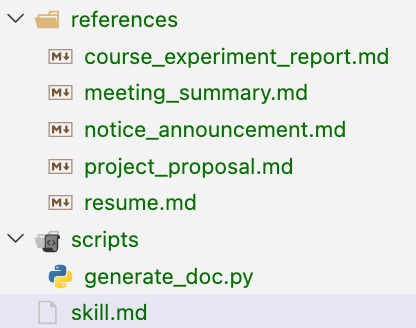

# skill

[可**分发**、可**复用**、面向具体库的 **skill** 包装层](../../%E6%A8%A1%E5%BC%8F/%E6%99%BA%E8%83%BD%E4%BD%93%E6%8A%80%E8%83%BD%E8%AE%BE%E8%AE%A1%E6%A8%A1%E5%BC%8F%2032d0f8d8d1fd8003a01ce9172be3f590.md) 

https://github.com/ceilf6/Lab/commit/aa312dbfdf97735385cbda7eda84985e1562cd7f

MCP协议提供了工具，

而skill提供了使用工具的经验

例如通过 metadata元数据 实现大模型 “懒加载”工具，而不是一开始就一股脑灌入

[格式](skill/%E6%A0%BC%E5%BC%8F%203210f8d8d1fd80798cf2f37315569f06.md)

[skill设计哲学](skill/skill%E8%AE%BE%E8%AE%A1%E5%93%B2%E5%AD%A6%203340f8d8d1fd80e99745ea6c97c8198e.md)

[Skill 设计模式实践指南](skill/Skill%20%E8%AE%BE%E8%AE%A1%E6%A8%A1%E5%BC%8F%E5%AE%9E%E8%B7%B5%E6%8C%87%E5%8D%97%203340f8d8d1fd80058c3adc795119a32d.md)

[agent-memory-optimizer](skill/agent-memory-optimizer%2033b0f8d8d1fd80d88544f116b342fadd.md)

[创建个人风格skill](skill/%E5%88%9B%E5%BB%BA%E4%B8%AA%E4%BA%BA%E9%A3%8E%E6%A0%BCskill%2033d0f8d8d1fd80c5b7abdb51794f2b1b.md)