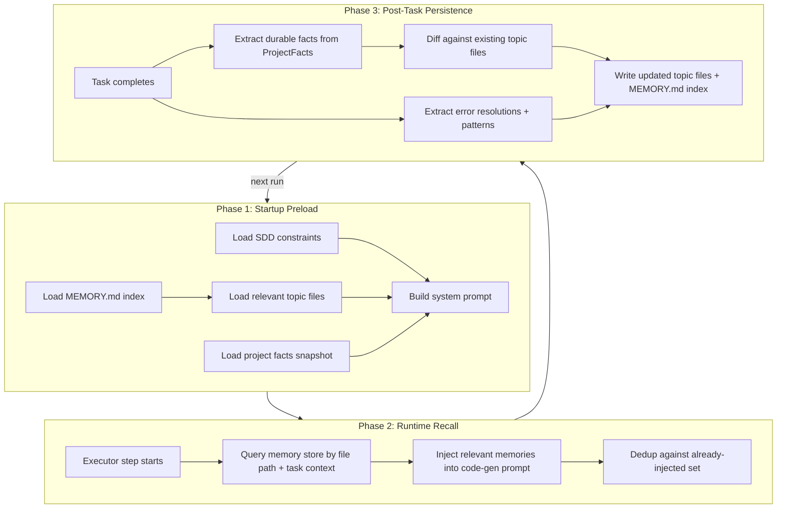

# cursor plan

# FrontAgent Memory System Optimization

## Current-State Four-Phase Audit

### Phase 1 -- Startup Preload: Partial

What exists today:

- SDD config loaded from disk, converted to system prompt via `SDDPromptGenerator.generate()` ([packages/core/src/agent.ts](https://www.notion.so/packages/core/src/agent.ts) L401-406)
- Skill content matched by task description and injected as `skillContext` ([packages/core/src/agent.ts](https://www.notion.so/packages/core/src/agent.ts) L367-370)
- Project file tree pre-scanned via `list_directory` ([packages/core/src/agent.ts](https://www.notion.so/packages/core/src/agent.ts) L413-447)
- RAG pre-retrieval before planning ([packages/core/src/agent.ts](https://www.notion.so/packages/core/src/agent.ts) L453)

What is missing:

- **No durable memory preload** -- every `frontagent run` starts completely fresh
- **Instructions and content are mixed** -- SDD rules, file contents, RAG results, skill context, and facts are concatenated into the same prompt parts
- **No memory index** (no `MEMORY.md` or topic files)

### Phase 2 -- Runtime Dynamic Recall: Weak

What exists today:

- RAG retrieval fires once before planning, not during execution
- `ProjectFacts` accumulates filesystem/dependency/module-graph state during execution ([packages/core/src/context.ts](https://www.notion.so/packages/core/src/context.ts) L178-201)
- `serializeFactsForLLM()` renders facts for error-recovery LLM calls ([packages/core/src/context.ts](https://www.notion.so/packages/core/src/context.ts) L952-1059)

What is missing:

- **No query-driven recall during executor code generation** -- each `create_file`/`apply_patch` LLM call gets static context, never dynamically recalled memories
- **No file/path-driven local rules** (`.cursorrules` equivalent)
- **No dedup tracking** for already-injected context
- **No retrieval budget**

### Phase 3 -- Post-Turn Persistence: Absent

Nothing persists after a task ends. The `finally` block in `execute()` deletes all context:

```
      this.currentTaskId = undefined;
      this.contextManager.clearContext(task.id);
```

The well-designed `ProjectFacts` (filesystem state, module dependency graph, error history) is discarded entirely. No learning extraction, no cross-session knowledge.

### Phase 4 -- Compaction Continuity: N/A (currently)

FrontAgent is a single-task CLI tool, so there is no multi-turn conversation to compact. This phase can be deferred until a multi-turn interactive mode is added.

---

## Primary Weaknesses (ranked by impact)

1. **Zero cross-session memory** -- every run re-discovers the same project patterns, error resolutions, and architectural decisions
2. **Rich facts system is ephemeral** -- `ProjectFacts` already extracts high-quality structured data (filesystem, deps, module graph, errors), but it is thrown away after each run
3. **Instructions and content are mixed** -- SDD rules, dynamic context, and factual memory are concatenated without clear separation or token budgeting
4. **RAG fires only once** -- no runtime recall during the executor's code-generation LLM calls
5. **No structured memory storage model** -- no index, no topic files, no scoping

---

## Target Architecture



Storage layout on disk:

```
<projectRoot>/.frontagent/memory/
  MEMORY.md              # index entrypoint (concise topic list)
  topics/
    project-structure.md  # filesystem layout, key modules
    dependencies.md       # packages, versions, known issues
    patterns.md           # learned coding patterns, conventions
    errors.md             # past error resolutions
    architecture.md       # discovered architecture decisions
  snapshots/
    facts-latest.json     # last ProjectFacts snapshot (serializable)
```

---

## Upgrade Plan (smallest-safe-first order)

### Step 1: Add structured memory storage layer

Create `packages/core/src/memory/` with:

- `types.ts` -- `MemoryEntry`, `MemoryIndex`, `MemoryTopic`, `MemoryConfig`
- `store.ts` -- `MemoryStore` class: read/write `MEMORY.md` index + topic files + facts snapshot from `<projectRoot>/.frontagent/memory/`

Key design rules:

- Human-readable Markdown files (inspectable, editable)
- JSON snapshot for ProjectFacts (efficient, diffable)
- All writes go through `MemoryStore` (single-writer)
- Token/byte budgets on preload

### Step 2: Add post-task persistence (Phase 3)

In [packages/core/src/agent.ts](https://www.notion.so/packages/core/src/agent.ts) `execute()` method:

- Before `clearContext()`, call `memoryStore.persistAfterTask(context)` to:
    - Export `ProjectFacts` snapshot to `snapshots/facts-latest.json`
    - Extract durable learnings (new files created, errors resolved, dependency changes) into topic files
    - Update `MEMORY.md` index with new/changed topics
- Use cursor-based extraction: only persist facts that changed since the last persisted revision
- Dedup against existing topic content to avoid duplicates
- Run off the critical path (fire-and-forget with error swallowing)

### Step 3: Add startup memory preload (Phase 1)

In [packages/core/src/agent.ts](https://www.notion.so/packages/core/src/agent.ts) constructor or `execute()`:

- Load `MEMORY.md` index + topic summaries (budgeted by token count)
- Load `facts-latest.json` to seed `ProjectFacts` with known filesystem/dep state
- Inject memory content as a separate system message block, clearly separated from SDD instructions
- Separate prompt structure:
    - Block 1: SDD behavioral instructions
    - Block 2: Memory content (project facts, patterns, past errors)
    - Block 3: Dynamic context (files, RAG, skills)

### Step 4: Add runtime recall during execution (Phase 2)

In executor action skills (code generation path):

- Before each `create_file`/`apply_patch` LLM call, query `MemoryStore` for relevant memories based on:
    - File path being modified (e.g., match `patterns.md` entries about that component type)
    - Error patterns (match `errors.md` for similar past failures)
- Inject matched memories as additional context in the code-gen prompt
- Track injected memory IDs to prevent re-injection within the same task
- Budget: max 2000 chars of memory context per code-gen call

### Step 5: Separate instructions from memory content (Phase 1 refinement)

Refactor `buildSystemPrompt()` in [packages/core/src/context.ts](https://www.notion.so/packages/core/src/context.ts):

- Clearly delineate three prompt zones:
    1. **Rules zone** -- SDD constraints, behavioral instructions (immutable per task)
    2. **Memory zone** -- durable project knowledge (loaded from `.frontagent/memory/`)
    3. **Context zone** -- dynamic per-task data (files, RAG, skills, facts)
- Each zone has its own token budget and can be independently trimmed

---

## Validation Checklist

- Fresh task with no prior memory: agent runs identically to current behavior (backward compatible)
- Second run after a create task: agent preloads facts snapshot and knows which files exist without re-scanning
- Error resolution persisted: if a dependency install was needed in run 1, run 2 knows the package is installed
- Runtime recall: when generating code for a component, agent recalls patterns from `patterns.md`
- Memory dedup: repeated runs do not create duplicate topic entries
- Token budget: memory injection stays within limits even for large projects
- Human inspectable: all memory files are readable Markdown/JSON