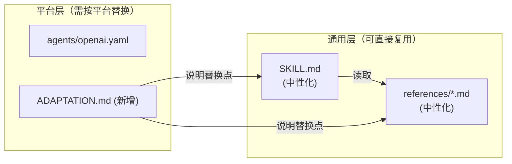

# 技能解耦重构

## 解耦策略

**核心原则：通用内容中性化，平台配置显式隔离。**

将每个技能拆分为两层：

- **通用层**：SKILL.md + references/ — 平台无关的知识和流程
- **平台层**：agents/ + 新增 ADAPTATION.md — 平台特定的命令、品牌词、适配说明



---

## 改动详情

### 1. `skill-creator` — 重点改造

**`[skills/skill-creator/SKILL.md](skills/skill-creator/SKILL.md)`**

在 front matter 中新增 `platform` 字段，声明当前平台配置：

```yaml
platform:
  name: FrontAgent
  cli: frontagent skill
```

将 Workflow 步骤中的 6 处硬编码命令改为通用占位描述，并在括号内注明对应的 FrontAgent 命令作为示例：

- `frontagent skill scaffold <skill-name>` → `用 Skill Lab CLI 创建骨架 (frontagent skill scaffold)`
- 其余命令同理，保留具体命令但以"示例"身份出现，而非唯一指令

**`[skills/skill-creator/references/workflow.md](skills/skill-creator/references/workflow.md)`**

将全文改写为"平台无关的操作步骤"描述，在每步末尾用 `> FrontAgent:` 标注具体命令，使文档结构清晰地区分"做什么"和"怎么做（平台相关）"。

**`[skills/skill-creator/agents/openai.yaml](skills/skill-creator/agents/openai.yaml)`**

- `display_name`: `"Skill Creator"` → 保持不变（已通用）
- `short_description`: 去除 "FrontAgent skills" → `"Create and iterate content skills with Skill Lab"`
- `default_prompt`: 去除 "FrontAgent content skill" 等品牌词

**新增 `[skills/skill-creator/ADAPTATION.md](skills/skill-creator/ADAPTATION.md)`**

说明迁移到其他平台时需要替换的内容：

- `frontagent skill` → 目标平台的 CLI 命令
- 需更新的文件列表和替换示例

---

### 2. `frontend-design` — 中等改造

**`[skills/frontend-design/SKILL.md](skills/frontend-design/SKILL.md)`**

- 删除开头第一段 "This FrontAgent skill is adapted from... MCP-based execution model."（共 2 行）
- 将 "SDD constraints" 替换为 "project design specification"（3 处）
- 将 "SDD-first workflow" 替换为 "specification-first workflow"

**`[skills/frontend-design/references/integration-guardrails.md](skills/frontend-design/references/integration-guardrails.md)`**

- 章节标题 `## Respect SDD and project rules` → `## Respect design specification and project rules`
- 正文中 "Treat SDD as a hard boundary..." → "Treat the project design specification as a hard boundary..."

**`[skills/frontend-design/agents/openai.yaml](skills/frontend-design/agents/openai.yaml)`**

- `short_description`: 去除 "FrontAgent guardrails" → `"Distinctive UI design with clear guardrails"`
- `default_prompt`: 去除 "SDD constraints" → "project design specification"

**新增 `[skills/frontend-design/ADAPTATION.md](skills/frontend-design/ADAPTATION.md)`**

说明 "project design specification" 在 FrontAgent 中对应 SDD，以及在其他平台的等价物（如 PRD、设计规范文档等）。

---

## 不需要改动的技能

- **`frontend-reviewer`**：内容完全通用，references 无平台特定词汇
- **`requirement-interviewer`**：已是