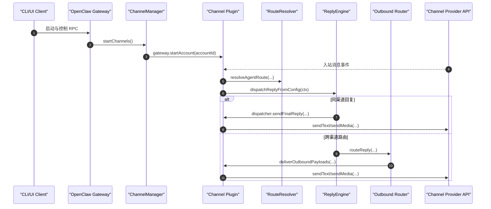
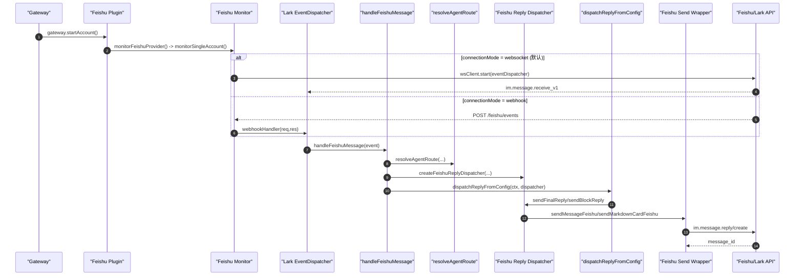

# 飞书、纸飞机 通信

飞书和通用插件链路基本一致，主要差别在入站传输和回复呈现

通用链路时序图

```mermaid
sequenceDiagram
  autonumber
  participant Op as "CLI/UI Client"
  participant Gw as "OpenClaw Gateway"
  participant Mgr as "ChannelManager"
  participant Plg as "Channel Plugin"
  participant Route as "RouteResolver"
  participant Engine as "ReplyEngine"
  participant Out as "Outbound Router"
  participant API as "Channel Provider API"

  Op->>Gw: 启动与控制 RPC
  Gw->>Mgr: startChannels()
  Mgr->>Plg: gateway.startAccount(accountId)

  API-->>Plg: 入站消息事件
  Plg->>Route: resolveAgentRoute(...)
  Plg->>Engine: dispatchReplyFromConfig(ctx)

  alt 同渠道回复
    Engine->>Plg: dispatcher.sendFinalReply(...)
    Plg->>API: sendText/sendMedia(...)
  else 跨渠道路由
    Engine->>Out: routeReply(...)
    Out->>Plg: deliverOutboundPayloads(...)
    Plg->>API: sendText/sendMedia(...)
  end
```

飞书默认是使用 WebSocket

```mermaid
sequenceDiagram
  autonumber
  participant Gw as "Gateway"
  participant Fei as "Feishu Plugin"
  participant Mon as "Feishu Monitor"
  participant Ev as "Lark EventDispatcher"
  participant Bot as "handleFeishuMessage"
  participant Rt as "resolveAgentRoute"
  participant Disp as "Feishu Reply Dispatcher"
  participant Core as "dispatchReplyFromConfig"
  participant Send as "Feishu Send Wrapper"
  participant Lark as "Feishu/Lark API"

  Gw->>Fei: gateway.startAccount()
  Fei->>Mon: monitorFeishuProvider() -> monitorSingleAccount()

  alt connectionMode = websocket (默认)
    Mon->>Lark: wsClient.start(eventDispatcher)
    Lark-->>Ev: im.message.receive_v1
  else connectionMode = webhook
    Lark-->>Mon: POST /feishu/events
    Mon->>Ev: webhookHandler(req,res)
  end

  Ev->>Bot: handleFeishuMessage(event)
  Bot->>Rt: resolveAgentRoute(...)
  Bot->>Disp: createFeishuReplyDispatcher(...)
  Bot->>Core: dispatchReplyFromConfig(ctx, dispatcher)
  Core->>Disp: sendFinalReply/sendBlockReply
  Disp->>Send: sendMessageFeishu/sendMarkdownCardFeishu
  Send->>Lark: im.message.reply/create
  Lark-->>Send: message_id
```