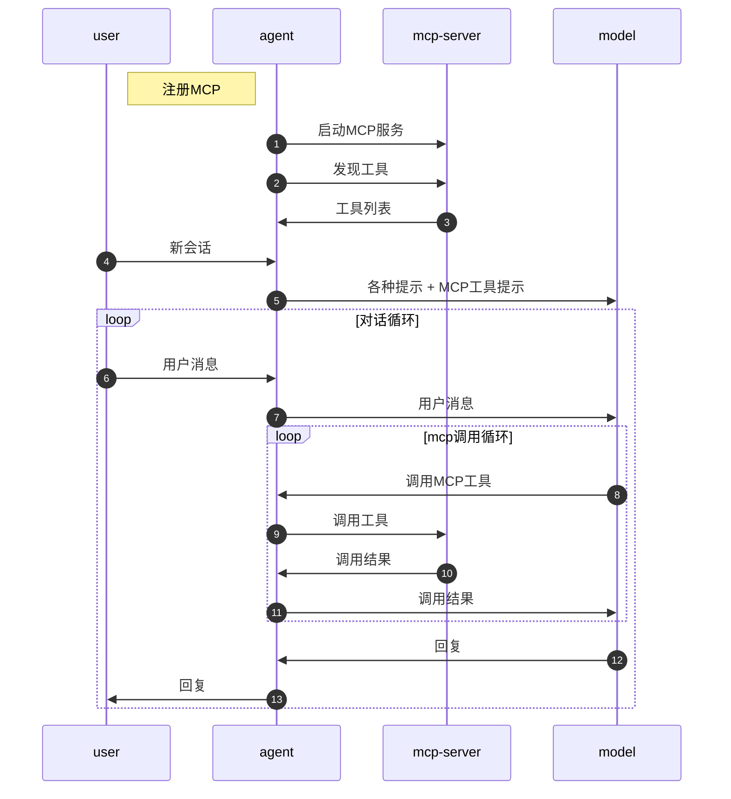
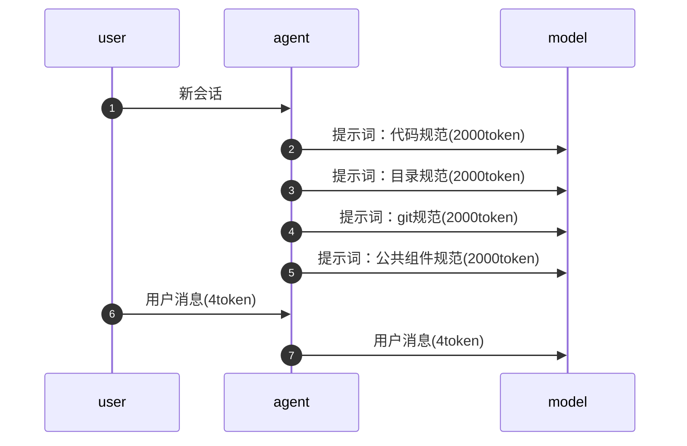
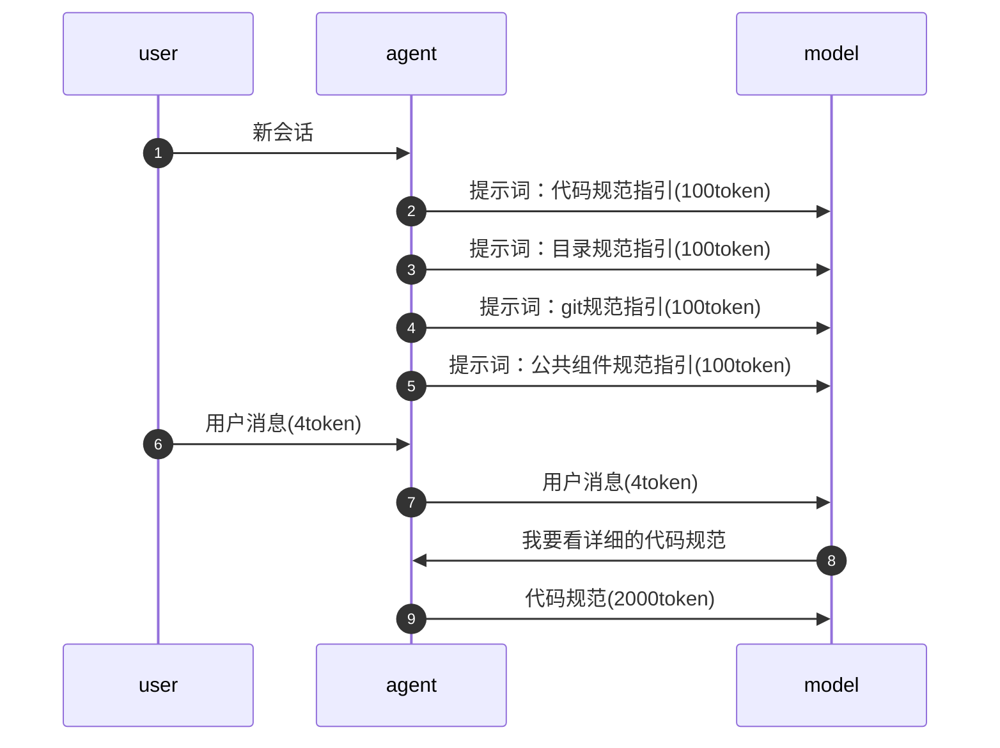

# AI效能工具

程序员角色：桥梁作用，现实 ↔ 计算机运行时

现实 ↔ 程序员沟通者 ←技术语言→ AI ↔ 计算机运行时

AI编程（可控性）

1. 技术认知：最核心
    
    技术语言
    
2. 范式：与工具无关
    
    使用 - 可控 harness 、可维护
    
3. 工具使用：概念

## 工具使用

### 工具选择

IDE + Coding Agent + 模型

> 差别不大
> 
1. IDE集成：VSCode、Cursor、Trae、....
2. IDE + Coding Agent + 模型：
    - Coding Agent：`Claude Code`、`Codex`、`OpenCode`、....
    - 模型：`Claude Sonnet`、`Claude Opus`、`Codex`、`Gemini`、`Kimi`、`GLM`、`Minimax`、...

### Claude Code封禁

一般机场IP都是会被检测的

1. 国外家庭IP
    
    国外中介 去找国外家庭，将国外家庭IP作为公网IP暴露，将其作为代理进行中转
    
    太贵
    
2. 中转
    
    “yunwu”
    
    黑盒 - 可能会换模型
    
3. claude code 只是作为 CLI ，用 国产模型
    
    只需要更改 Agent config 发送地址（例如参照 kimi “接入第三方 Coding Agent）
    
    例如用 cc switch 
    

### codex封禁

1. 淘宝、闲鱼 “拼团” “拼车”
2. 官方付款 国外信用卡 国外代付

### Coding Agent原理

### tools

```bash
总结一下这个项目在干什么 ---> 大模型 ---> ????
```

Coding Agent

1. 加 **系统提示词**
    - 告诉大模型，目前**项目代码的路径**
    - 告诉大模型，**可以使用哪些工具**
        
        例如
        
        - ls
        - read
2. 将用户问题和提示词一起传递给大模型
3. 大模型根据情况决定是否要使用工具。当需要使用工具的时候，它会返回一个**JSON格式**
    
    ```jsx
    {
    	type: "tool_use",
    ```
    
4. Agent, 它就会拿到这个JSON格式，然后根据JSON格式的内容决定接下来如何处理
    
    Agent 作为一段程序
    
5. Agent将执行的结果，然后返回给模型，又输入给大模型
6. 后续呢，继续交互性的操作，就大模型跟Agent之间不停的交互，直到得得到一个最终的答案
**while(1) 直到最后不再调用 tool**

常用工具：

- command
- read
- write
- delete

### 会话

**conversation / session / thread**

这个字段标志着当前会话 **ID**

在同一个会话里边，每一次用户发消息都要把之前的所有历史消息内容全部带上

过程中**通过 role 区分是 user用户 还是 system系统 还是 AI回复**

> 如果没有 会话 的话，那么就是像 HTTP 无状态了、无法理解背景
> 

### 提示词

每次会话自动携带

目的是让大模型快速了解，避免重新认知、减少上下文占用

1. 全局提示词
    
    所有工程都会附带上，一般保存在用户目录，例如
    
    - ~/.claude/CLAUDE.md
    - ~/.codex/AGENTS.md
    - codex 的设置中的“个性化”
    
    ```jsx
    1. 不确定的问题一定要向用户提问，不要自行决定
    ```
    
    （公司内网的话可以告知 mis 号）
    
2. 工程提示词
    
    具体仓库中存放的 [AGENTS.md](http://AGENTS.md) 和 [CLAUDE.md](http://CLAUDE.md) 
    
    按项目目录层级读取项目内的 `AGENTS.md`，例如从仓库根目录一路到当前工作目录；越靠近当前目录的指令越具体
    
    ```jsx
    # 工程简要描述
    ## 开发规范
    
    ## 技术栈与工程结构
    
    ## 
    ```
    

### 深度思考/推理/思维链

- 一般的：用户问题 ---> 模型 ---> 回复
- 深度思考：用户问题（提示词“要深度思考”） ---> 模型 ---> 思考过程 ---> 模型 ---> 确定性更高的回复

所以深度思考的本质就是将 思考过程 重新喂给模型，**模型给自己生成提示词**

### MCP

可以简单的理解为：MCP就是一个 **tool工具的集合**

个性化、定制服务

1. 注册 MCP
    
    例如 [mcp.so](http://mcp.so) 上
    
    将 **用于配置的JSON对象** 复制到 IDE 的 “MCP服务器” 中，或者在 **.vscode/mcp.json**
    
    ```jsx
    {
    	"servers": {
    		"io.github.ChromeDevTools/chrome-devtools-mcp": {
    			"type": "stdio",
    			"command": "npx",
    			"args": [
    				"--registry",
    				"https://registry.npmjs.org",
    				"chrome-devtools-mcp@0.25.0"
    			],
                // npx --registry https://registry.npmjs.org chrome-devtools-mcp@0.25.0
    			"gallery": "https://api.mcp.github.com",
    			"version": "0.25.0"
    		}
    	},
    	"inputs": []
    }
    ```
    
    别人写好的程序，通过命令去启动程序，例如 npx-NodeJS; uvx-python
    
2. Agent 会启动 MCP 服务器，按照配置的命令 如 // npx --registry https://registry.npmjs.org chrome-devtools-mcp@0.25.0
    
    有些在本地、有些在远端
    
    （像 vscode 可以设置是否勾选启用）
    
3. Agent 会和 服务 进行通信，“请问你这个服务为我提供了哪些工具”
    
    例如 chrome-devtools-mcp 提供了在浏览器执行各种操作，例如截屏、点击、获取元素…
    
    MCP服务器返回工具列表，就像系统提示词中的 tools 定义JSON对象
    
    到时候系统提示词 tools 列表就会加入 启动的MCP服务器支持的tools
    
4. 运行时和调用 tool 一样，大模型返回 “我要调用 … tool“ 意愿，真正执行的是 MCP客户端，它把调用转发给对应 MCP Server，然后把结果再返回给模型



- figma 设计稿文件还原 → 代码
- markitdown 转为 md 格式

注意，无论什么工具，都需要通过提示词的方式暴露给模型，意味着工具过多就会占用上下文过多

### Skill

Skill最初要解决的问题是**提示词过大**的问题。 

- 代码规范
- 目录规范

skill 第一次引入了**渐进式**提示方案。

像我们开发时也不是先看技术文档，而是遇到细节问题时再去查看

[SKILL.md](http://SKILL.md) 先告诉大模型指引（经验）

meta 元数据

**只有元数据会被发送给 agent**，等到 agent 觉得合适的时候才会读取整个 SKILL

```jsx
---
name: 必须和 文件夹名字 一致
description: 
---
```

```jsx
1.1 通过 scripts/getData 获取数据
```

和提示词一样也分为

- 全局：~/.codex/skills, .claude/skills
- 工程：.agents/skills

**无渐进式方案：**



**渐进式方案：**



skill商店：[https://skills.sh/](https://skills.sh/)

[注意，无论什么工具，都需要通过提示词的方式暴露给模型，意味着工具过多就会占用上下文过多](AI%E6%95%88%E8%83%BD%E5%B7%A5%E5%85%B7%203550f8d8d1fd800aa88fc07a8935cd72.md) 

建议 skills 不要超过 12 个

### cli

渐进式工具

chrome devtools cli 通过 tool JSON 只告诉模型 “可以操控浏览器”

在模型使用时返回 chrome-dev **—help 查询具体命令**，渐进式使用

### Sub Agent

**@** 符号可以标注文件

显式告诉开启子代理（team）

子代理拥有**独立**的：提示词、会话上下文[、skills、tools、权限边界...]

子代理的优势：

- 独立会话，**不污染主代理上下文**
- 可**并行**执行，缩短任务总**时长**
- **能力专注**，更适合专项任务

Coding Agent一般会有两种形式的子代理：

- **内置**子代理：系统内置的代理，不同厂商设置不同，**用户无法干预**
    
    例如用于进行 对抗性CR 等等专门用途
    
- **用户**子代理：用户**要求**启动的子代理，通常用于完成各种并行、独立的开发任务，需要用户用**提示词启动**

上下文占用超过一半以上幻觉几率就会变大、并且就会开始焦虑想赶紧结束了，所以面对大需求可以拆分为多个模块的情况最好还是多开子代理

### worktree 并行开发

“ 开多个子代理分别对  进行开发，**每个子代理开一个 worktree**，最后由你验收，如果没问题就合并到主分支，合并时注意保持主分支的线性提交 “

worktree 本质就是用目录管理分支（原先是工作区一个分支）worktree 是一个目录一个分支，可以多个分支同时开发

合并时：`git cherry-pick` 的作用是：**把某一个或多个已有 commit 的改动，单独“摘”到当前分支上**

### 长期记忆

Coding Agent 有内置的长期记忆系统，会记录和用户的沟通过程中沉淀的经验和教训。

例如记录到 SQLite 或者 文件 中

像 codex 就是记录到 ~/.codex/memories

长期记忆肯定会加入到会话中，需要考虑到上下文

**全局提示词** 本质就是 用户管理的长期记忆

Agent 核心差距是 **提示词**+模型（模型是针对提示词微调过的）

需要大量测试判别效果

### 开发范式

vibe coding: 氛围编程

spec coding：SDD, Spec-driven development 规范驱动开发

- Spec-kit
- OpenSpec
    
    通过 **工作流** 规定 Agent 怎么做完整软件工程流程，将其变成 **可验证状态机**
    
    例如：先写 spec，再生成 plan，再拆 tasks，再实现，再验证
    
- **SuperPowers**
    
    SuperPowers 本质就是提供一系列 **skills** ，然后软链接给 Agent 使用
    
    通过 skills 给智能体明确流程
    

## 最佳实践

目的：精简上下文

1. 每一个会话应该保持**独立**和**连续**。（尽量**减少会话中的内容**）
    
    **历史信息**的 Token消耗、上下文占用导致的记忆、幻觉问题
    
2. 提示词始终保持**精简**
    
    和 1 一样，都是为了上下文，防止记忆、幻觉问题
    
3. 文档尽量的**细粒度拆分**
    
    方便 LLM **渐进式**探索
    
4. skill数量不宜超过12个
    
    [注意，无论什么工具，都需要通过提示词的方式暴露给模型，意味着工具过多就会占用上下文过多](AI%E6%95%88%E8%83%BD%E5%B7%A5%E5%85%B7%203550f8d8d1fd800aa88fc07a8935cd72.md) 
    
5. **独立**、**并行**任务适合使用子代理完成
6. **奖罚**分明，有利于形成**长期**记忆