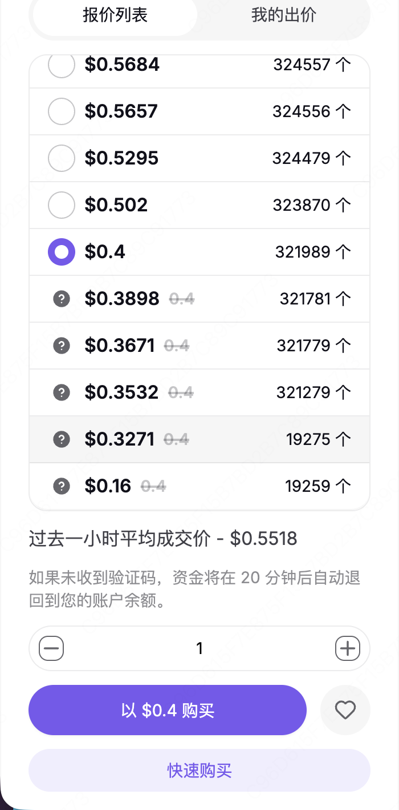

# backup

注意：中转节点应该选美国，否则从公司新加坡 IP 跳过去等等也很慢

## **注意**

一个apple只能订阅一个claude账号，并且不同apple账号的app store余额不能共用，所以当想要开多个 claude code 订阅时得一个一个apple账号自己兑换gift卡

目前的邮件矩阵有

- 3506456886@proton.me
- 35064568861@proton.me
- 35064568862@proton.me

https://github.com/farion1231/Way-to-ChatGPT-Plus

33123 端口经常挂，但是 22 不会，直接用 22 进行 SSH 连接

全局模式把太多无关流量压到 VPS 了，导致 timeout

[分流](backup/%E5%88%86%E6%B5%81%203950f8d8d1fd8089a4bef4442f258002.md)

购买礼品卡 [https://www.apple.com/shop/buy-giftcard/giftcard](https://www.apple.com/shop/buy-giftcard/giftcard)

https://www.meiguodizhi.com/usa-address/montana

5342930010364218

04/34 541

```jsx
Ali levy

4639 Stoney Lonesome Road

59450

570-320-0543

```

注意不要填错，否则会有一个窗口期无法扣费

同一个家宽帐号有 1 个 Ipv4 和很多的 Ipv6 前缀

IPv4 和 IPv6 是两套并列地址系统，不是父子关系

万能的闲鱼 🐟 海鲜市场

注意接码别傻乎乎选最贵的



https://hero-sms.com/cn

常用的接码平台：Hero-SMS、5Sim、Receive-SMS

[纯净IP](backup/%E7%BA%AF%E5%87%80IP%2037b0f8d8d1fd80319cc0eee907c06545.md)