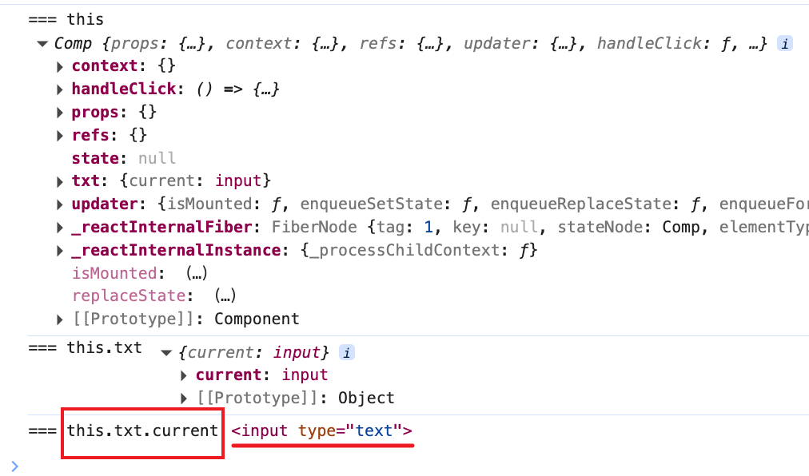

# ref

https://github.com/ceilf6/Lab/commit/0f28d78db750cfe4812f1524a7e94d70376be306

reference: 引用

场景：希望**直接使用dom元素中的某个方法**，或者希望直接使用自定义组件中的某个**方法**

像 React 只能负责处理渲染

ref 用法和Vue类似

1. ref作用于**React内置html**组件，得到的将是**真实的dom对象**
2. ref作用于**类**组件，得到的将是**类的实例**
3. 以前函数组件没有ref，现代函数组件推荐使用 **useRef()**
    
    以前可以在函数组件内部、内置组件或类组件上用ref
    

ref不再推荐使用字符串赋值，字符串赋值的方式将来可能会被移出

目前，**ref推荐使用对象或者是函数**

**对象**

https://github.com/ceilf6/Lab/commit/68ececb7f9d90eb84c92c3bde1c5fcad282c115e

通过 **React.createRef** 函数创建，例如保存到了 this.txt 时

通过 this.txt.current 调用

```jsx
import React, { Component } from 'react'

export default class Comp extends Component {
    constructor(props) {
        super(props);
        this.txt = React.createRef();
    }

    handleClick = () => {
        const cur = this.txt.current
        console.log("=== this", this)
        console.log("=== this.txt", this.txt)
        console.log("=== this.txt.current", cur)
        cur.focus();
    }

    render() {
        return (
            <div>
                <input ref={this.txt} type="text" />
                <button onClick={this.handleClick}>聚焦</button>
            </div>
        )
    }
}

```



**函数**

https://github.com/ceilf6/Lab/commit/039c17430c5409f185ab6bf49ee8469925144838

直接给 ref 赋值函数

```jsx
<... ref={el => this.txt = el;} />
```

保存到了 this.txt 上

到时候用的时候不需要再取 .current

函数的调用时间：

1. **componentDidMount**挂载后 的时候会调用该函数 ⇒ 可以使用ref
2. 如果ref的值发生了变动（旧的函数被新的函数替代），分别调用旧的函数以及新的函数，时间点出现在componentDidUpdate之前
    1. 旧的函数被调用时，传递null
    2. 新的函数被调用时，传递对象
3. 如果ref所在的组件被卸载，会调用函数

```jsx
import React, { Component } from 'react'

export default class Comp extends Component {

    state = {
        show: true
    }

    handleClick = () => {
        // this.txt.focus();
        this.setState({
            show: !this.state.show
        });
    }

    componentDidMount() {
        console.log("didMount", this.txt);
    }

    // 写在外面的话函数就不变就不会两次
    getRef = el => {
        console.log("函数被调用了", el);
        this.txt = el;
    }

    render() {
        return (
            <div>
                {
                    this.state.show && <input
                        ref={el => {
                            console.log("函数被调用了", el);
                            this.txt = el;
                        }} type='text' /> // this.getRef} type="text" />
                }
                <button onClick={this.handleClick}>显示/隐藏</button>
            </div>
            /*
            如果不是通过 外部的getRef 那么每次 render 都会重新创建一个新函数
            函数会调用两次
            如果ref的值发生了变动（旧的函数被新的函数替代），分别调用旧的函数以及新的函数
            第一次 null ，即旧的函数被调用
            第二次是目标
            */
        )
    }
}

```

**谨慎使用ref**

能够使用属性和状态进行控制，就不要使用ref。

1. 调用真实的DOM对象中的方法
2. 某个时候需要调用类组件的方法