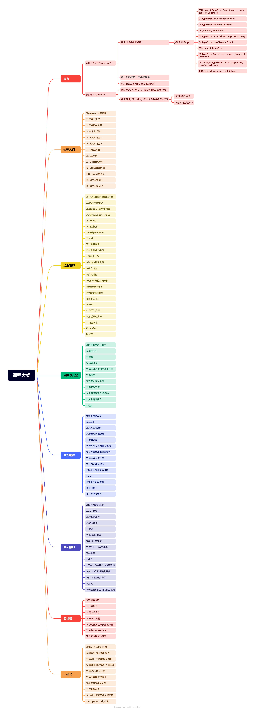

# TS

JS动态语言是对值的操作

TS静态语言是对类型的操作

[类型](TS/%E7%B1%BB%E5%9E%8B%203190f8d8d1fd801e9feecd09ed54dbb6.md)

[演练场](TS/%E6%BC%94%E7%BB%83%E5%9C%BA%2031f0f8d8d1fd8068afb2e493ec11d295.md)

[配置](TS/%E9%85%8D%E7%BD%AE%2031f0f8d8d1fd807eb535d7d45c471ee3.md)

[常见类型](TS/%E5%B8%B8%E8%A7%81%E7%B1%BB%E5%9E%8B%2031f0f8d8d1fd801e8dddc24164459155.md)

[类型声明](TS/%E7%B1%BB%E5%9E%8B%E5%A3%B0%E6%98%8E%203200f8d8d1fd80eaba67dd866984e26a.md)

[TS+React+vite](TS/TS+React+vite%203200f8d8d1fd80b9b5c4f71b46c5cfe3.md)

[infer](TS/infer%203200f8d8d1fd80c49125fcf8bd072646.md)

[abstract](TS/abstract%203290f8d8d1fd8004a0e8c984c91004e0.md)