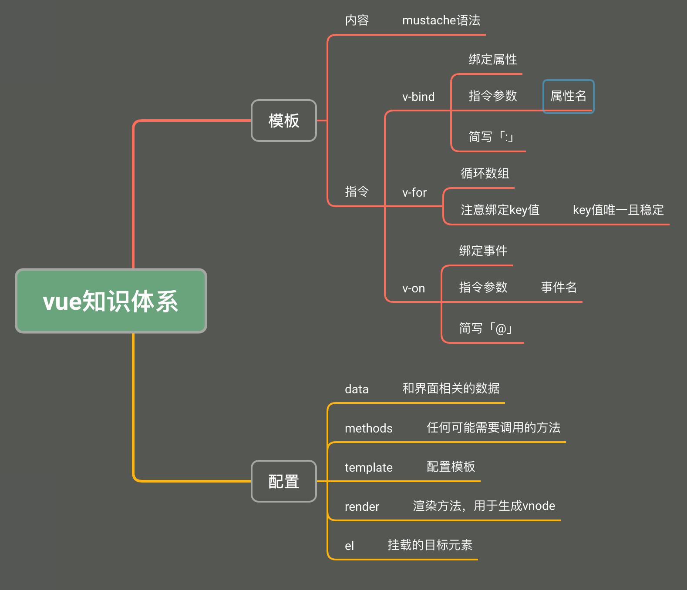

# Vue2

[前端框架由来](Vue2/%E5%89%8D%E7%AB%AF%E6%A1%86%E6%9E%B6%E7%94%B1%E6%9D%A5%202f90f8d8d1fd806ab964cc57fe871a56.md)

模版 → vue → 真实DOM

数据变化 → UI重现渲染

[核心概念](Vue2/%E6%A0%B8%E5%BF%83%E6%A6%82%E5%BF%B5%202f90f8d8d1fd80419d0fe1561ea1cd6e.md)

[模版](Vue2/%E6%A8%A1%E7%89%88%202f90f8d8d1fd801a843bc6987ad31546.md)

[配置](Vue2/%E9%85%8D%E7%BD%AE%202f90f8d8d1fd80b1bf1df63d10d85ce2.md)

[Vue实例成员属性](Vue2/Vue%E5%AE%9E%E4%BE%8B%E6%88%90%E5%91%98%E5%B1%9E%E6%80%A7%202fc0f8d8d1fd80e29fadff7cf0e19622.md)

[内置组件<slot](Vue2/%E5%86%85%E7%BD%AE%E7%BB%84%E4%BB%B6%20slot%202fd0f8d8d1fd80f585e7e3f6bf5c510f.md)

[插件>路由、状态管理](Vue2/%E6%8F%92%E4%BB%B6%20%E8%B7%AF%E7%94%B1%E3%80%81%E7%8A%B6%E6%80%81%E7%AE%A1%E7%90%86%202fd0f8d8d1fd8069a0e0ff10a7a72b9d.md)

[组件](Vue2/%E7%BB%84%E4%BB%B6%202fa0f8d8d1fd8035b10ed2d988e5b61a.md)

[vue/cli](Vue2/vue%20cli%202fa0f8d8d1fd8094ab52cb87a0b6a043.md)

[实践: pager组件开发](Vue2/%E5%AE%9E%E8%B7%B5%20pager%E7%BB%84%E4%BB%B6%E5%BC%80%E5%8F%91%202fb0f8d8d1fd803989acf30a766a483d.md)

[实践: toast消息提示](Vue2/%E5%AE%9E%E8%B7%B5%20toast%E6%B6%88%E6%81%AF%E6%8F%90%E7%A4%BA%202fd0f8d8d1fd80009334d154ca460007.md)

[组件生命周期](Vue2/%E7%BB%84%E4%BB%B6%E7%94%9F%E5%91%BD%E5%91%A8%E6%9C%9F%202fe0f8d8d1fd809f87e9fe5a30f07504.md)

[“个人空间”实践](Vue2/%E2%80%9C%E4%B8%AA%E4%BA%BA%E7%A9%BA%E9%97%B4%E2%80%9D%E5%AE%9E%E8%B7%B5%202fe0f8d8d1fd80938a0ed9079c053246.md)

[自定义指令](Vue2/%E8%87%AA%E5%AE%9A%E4%B9%89%E6%8C%87%E4%BB%A4%202fe0f8d8d1fd80df9f0bde4b8e2f36b7.md)

[事件总线 发布订阅模式](Vue2/%E4%BA%8B%E4%BB%B6%E6%80%BB%E7%BA%BF%20%E5%8F%91%E5%B8%83%E8%AE%A2%E9%98%85%E6%A8%A1%E5%BC%8F%203020f8d8d1fd80d2909ffe2d4c0abb0c.md)

[数据共享 vuex](Vue2/%E6%95%B0%E6%8D%AE%E5%85%B1%E4%BA%AB%20vuex%203020f8d8d1fd807d928de5db04f8194d.md)

[vuex案例 登陆注销鉴权](Vue2/vuex%E6%A1%88%E4%BE%8B%20%E7%99%BB%E9%99%86%E6%B3%A8%E9%94%80%E9%89%B4%E6%9D%83%203030f8d8d1fd805bb469d5682724e8f1.md)

[异步组件](Vue2/%E5%BC%82%E6%AD%A5%E7%BB%84%E4%BB%B6%203030f8d8d1fd80b48bf6c35d7b253919.md)