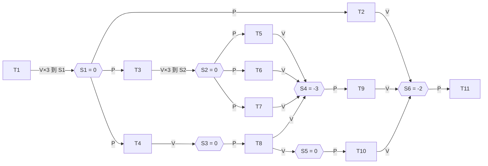

# 第6题黑板解法还原分析报告

## 执行摘要

本报告依据你上传的黑板照片，逐列还原老师在第 6 题上写出的 11 个任务列、6 个合并信号量以及红框中的初值计算逻辑。和题面前驱图对照后可以看出，老师采用的正是“**同前驱合并** + **同后继合并**”的最少 6 信号量方案：

`T1→{T2,T3,T4}`、`T3→{T5,T6,T7}`、`T4→T8`、`{T5,T6,T7,T8}→T9`、`T8→T10`、`{T2,T9,T10}→T11`。fileciteturn2file0

黑板红框最关键的一点是：

- 老师写的并**不是**“`V总数 - P总数`”
- 而是“**`P总数 - V总数`**”

因此才会出现：

- `S4 = 1 - 4 = -3`
- `S6 = 1 - 3 = -2`

这两个负数**不是算错**，而是老师把“多前驱汇合点需要做多次 `P`”压缩成了“后继只做一次 `P`，但允许信号量初值为负”的课堂写法。

也就是说，你之前觉得“我和老师不一样”，真正原因不是谁算错了，而是：

- 我前面给你的，是**工程上最常见的写法**：所有初值取 0，但 `T9` 要做 4 次 `P`、`T11` 要做 3 次 `P`
- 老师黑板上给的，是**课堂里的压缩写法**：`T9`、`T11` 只写一次 `P`，然后把“缺掉的等候次数”折进初值里

按老师黑板方法，最小初值应为：

\[
\boxed{S_1=0,\;S_2=0,\;S_3=0,\;S_4=-3,\;S_5=0,\;S_6=-2}
\]

如果考试按老师课堂方法判分，你就应该写这组值；如果老师要求写成常见程序实现，则改成“**全 0 初值 + T9 连做 4 次 P + T11 连做 3 次 P**”。

## 从图片逐列还原老师写的 11 个任务列

从黑板上方 11 个椭圆任务列，自左向右可以读成下面这组内容。

其中第 4 列顶部笔迹略淡，但结合上下文、红框公式和原前驱图，可以唯一确定为 `P(S1)`。fileciteturn2file0

### 逐列识别结果

1. **T1 列**
    - `T1`
    - `V(S1)`
    - `V(S1)`
    - `V(S1)`
2. **T2 列**
    - `P(S1)`
    - `T2`
    - `V(S6)`
3. **T3 列**
    - `P(S1)`
    - `T3`
    - `V(S2)`
    - `V(S2)`
    - `V(S2)`
4. **T4 列**
    - `P(S1)`
    - `T4`
    - `V(S3)`
5. **T5 列**
    - `P(S2)`
    - `T5`
    - `V(S4)`
6. **T6 列**
    - `P(S2)`
    - `T6`
    - `V(S4)`
7. **T7 列**
    - `P(S2)`
    - `T7`
    - `V(S4)`
8. **T8 列**
    - `P(S3)`
    - `T8`
    - `V(S4)`
    - `V(S5)`
9. **T9 列**
    - `P(S4)`
    - `T9`
    - `V(S6)`
10. **T10 列**
    - `P(S5)`
    - `T10`
    - `V(S6)`
11. **T11 列**
    - `P(S6)`
    - `T11`

把这 11 列重新按“一个信号量服务哪一组边”来整理，就得到老师的 6 个信号量。

## 六个合并信号量及其前驱集合、后继集合

这里的“前驱集合”指在该信号量上执行 `V(...)` 的任务集合；“后继集合”指在该信号量上执行 `P(...)` 的任务集合。

| 信号量 | 前驱集合 | 后继集合 | 含义 |
| --- | --- | --- | --- |
| S1 | {T1} | {T2, T3, T4} | 把 `T1 -> T2,T3,T4` 三条边合并 |
| S2 | {T3} | {T5, T6, T7} | 把 `T3 -> T5,T6,T7` 三条边合并 |
| S3 | {T4} | {T8} | 对应单边 `T4 -> T8` |
| S4 | {T5, T6, T7, T8} | {T9} | 把 `T5,T6,T7,T8 -> T9` 四条边合并 |
| S5 | {T8} | {T10} | 对应单边 `T8 -> T10` |
| S6 | {T2, T9, T10} | {T11} | 把 `T2,T9,T10 -> T11` 三条边合并 |

这与题面前驱图完全对应。fileciteturn2file0

如果把图论语言换成你更好记的说法，就是：

- **同前驱合并**：`T1` 发散到 `T2,T3,T4`，合成 `S1`；`T3` 发散到 `T5,T6,T7`，合成 `S2`
- **同后继合并**：`T5,T6,T7,T8` 汇到 `T9`，合成 `S4`；`T2,T9,T10` 汇到 `T11`，合成 `S6`
- **单边保留**：`T4->T8` 用 `S3`，`T8->T10` 用 `S5`

## P/V 次数统计与红框算式逐项还原

### 先按任务 T1 到 T11 分列统计

为便于看黑板红框的来历，先把每个信号量在哪些任务里出现了 `P` 或 `V` 逐项列出。记号：

- `P1` = 出现 1 次 `P`
- `V1` = 出现 1 次 `V`
- `V3` = 出现 3 次 `V`
- `—` = 该任务不涉及此信号量

| 信号量 | T1 | T2 | T3 | T4 | T5 | T6 | T7 | T8 | T9 | T10 | T11 |
| --- | --- | --- | --- | --- | --- | --- | --- | --- | --- | --- | --- |
| S1 | V3 | P1 | P1 | P1 | — | — | — | — | — | — | — |
| S2 | — | — | V3 | — | P1 | P1 | P1 | — | — | — | — |
| S3 | — | — | — | V1 | — | — | — | P1 | — | — | — |
| S4 | — | — | — | — | V1 | V1 | V1 | V1 | P1 | — | — |
| S5 | — | — | — | — | — | — | — | V1 | — | P1 | — |
| S6 | — | V1 | — | — | — | — | — | — | V1 | V1 | P1 |

这张表正好就是老师黑板上画的 11 个椭圆，按信号量重新汇总后的版本。

### 再统计每个信号量的总 P 和总 V

下面这张表，就是把上表按行求总数。它同时回答你提出的 8 个字段要求：**信号量名、前驱集合、后继集合、V总数、P总数、净差、建议初值**。

为了避免再混淆，我把“净差”同时写成两种形式：

- **老师黑板实际写法**：`P总数 - V总数`
- **如果你强行改写成 V总数 - P总数**：数值正负号全部相反

| 信号量 | 前驱集合 | 后继集合 | V总数 | P总数 | 老师黑板实际写法 `P−V` | 若改写成 `V−P` | 建议初值 |
| --- | --- | --- | --- | --- | --- | --- | --- |
| S1 | {T1} | {T2,T3,T4} | 3 | 3 | `3-3=0` | `3-3=0` | 0 |
| S2 | {T3} | {T5,T6,T7} | 3 | 3 | `3-3=0` | `3-3=0` | 0 |
| S3 | {T4} | {T8} | 1 | 1 | `1-1=0` | `1-1=0` | 0 |
| S4 | {T5,T6,T7,T8} | {T9} | 4 | 1 | `1-4=-3` | `4-1=+3` | -3 |
| S5 | {T8} | {T10} | 1 | 1 | `1-1=0` | `1-1=0` | 0 |
| S6 | {T2,T9,T10} | {T11} | 3 | 1 | `1-3=-2` | `3-1=+2` | -2 |

### 红框的 6 条式子逐项还原

严格照黑板恢复，应该写成：

\[
\begin{aligned}
S_1 &= 3-3 = 0\\
S_2 &= 3-3 = 0\\
S_3 &= 1-1 = 0\\
S_4 &= 1-4 = -3\\
S_5 &= 1-1 = 0\\
S_6 &= 1-3 = -2
\end{aligned}
\]

所以，**如果你要求“把红框逐项还原为 `V总数 - P总数`”，那其实就不是照黑板原样还原，而是把黑板公式改写成相反方向的统计**。

按 `V总数 - P总数` 写的话，会变成：

\[
\begin{aligned}
S_1 &: 3-3 = 0\\
S_2 &: 3-3 = 0\\
S_3 &: 1-1 = 0\\
S_4 &: 4-1 = +3\\
S_5 &: 1-1 = 0\\
S_6 &: 3-1 = +2
\end{aligned}
\]

这就**不再是黑板上的红框原式**了。

因此，想和老师答案一致，必须记住：

> **黑板红框用的是 `P总数 - V总数`，不是 `V总数 - P总数`。**
> 

## 为什么会出现负数以及老师到底在算什么

### 老师的核心思路是“收支平衡”

老师黑板红框最像是在做一个统一的“收支平衡”：

\[
S_i^{(0)} = \#P(S_i) - \#V(S_i)
\]

其中：

- \(\#P(S_i)\) = 全程序里这个信号量被 `P` 了几次
- \(\#V(S_i)\) = 全程序里这个信号量被 `V` 了几次
- \(S_i^{(0)}\) = 该信号量初值

这样做的好处是，在所有任务都结束后：

\[
S_i^{(\text{end})} = S_i^{(0)} + \#V(S_i) - \#P(S_i) = 0
\]

也就是说，**老师是在把每个信号量最后都“结账”为 0**。

这就是为什么红框里的数正好都能写成“某个差值”。

### 为什么 S4 和 S6 会是负数

负数出现在两种“多前驱汇合”的地方：

- `T5,T6,T7,T8 -> T9`
- `T2,T9,T10 -> T11`

这里的共同特点是：

- 有很多前驱任务，各自会做一次 `V`
- 但老师只想让后继任务写**一次** `P`

于是就会出现：

- `S4`: 前驱做 4 次 `V`，后继 `T9` 只做 1 次 `P`
- `S6`: 前驱做 3 次 `V`，后继 `T11` 只做 1 次 `P`

如果仍然坚持用同一个信号量来表达“必须等所有前驱都完成”，那就只能把“缺掉的等待次数”折进初值里。

因此：

\[
S_4^{(0)} = 1 - 4 = -3
\]

\[
S_6^{(0)} = 1 - 3 = -2
\]

### 负数的直观含义

可以把它理解成“**还欠多少个许可**”。

以 `S4 = -3` 为例。

`T9` 只写一次 `P(S4)`，但它实际上要等 4 个前驱：

- T5
- T6
- T7
- T8

老师把这件事压缩成：

- 前驱们总共给 4 次 `V(S4)`
- `T9` 自己只写一次 `P(S4)`
- 其余“还差的 3 次等待”预先记在初值 `3` 里

所以 `-3` 可以理解成：

> “这个后继现在还欠 3 个额外许可；再加上它自己那一次 `P`，总共要等满 4 次前驱完成。”
> 

同理：

- `S6 = -2` 表示 `T11` 虽然只写一次 `P(S6)`，但它其实要等 3 个前驱，因此另外 2 次等待被折进初值里了。

### 一个特别好记的规律

老师这种方法可以浓缩成三条：

- **单边 `1 -> 1`**：初值 0
- **扇出 `1 -> k`**：前驱 `V` 共 k 次，后继各 `P` 一次，初值 0
- **汇合 `k -> 1`**：前驱各 `V` 一次，后继只 `P` 一次，初值是
\[
1-k
\]

所以：

- `S4`: \(1-4=-3\)
- `S6`: \(1-3=-2\)

这就是老师黑板负数最本质的来源。

### 和我们前面讨论的“全 0 初值方案”到底差在哪里

这一步最值得你彻底理解。

前面讨论的“工程写法”是：

- **所有信号量初值都取 0**
- 对于汇合点，后继任务做多次 `P`

比如：

- `T9` 做 4 次 `P`
- `T11` 做 3 次 `P`

而老师黑板写法是：

- `T9` 只做 1 次 `P`
- `T11` 只做 1 次 `P`
- 但 `S4=-3`
- `S6=-2`

所以两者实际上是**同一种同步逻辑的两种写法**：

| 汇合点 | 工程写法 | 老师黑板写法 |
| --- | --- | --- |
| `T5,T6,T7,T8 -> T9` | `S4=0`，`T9` 做 `P(S4)` 四次 | `S4=-3`，`T9` 做 `P(S4)` 一次 |
| `T2,T9,T10 -> T11` | `S6=0`，`T11` 做 `P(S6)` 三次 | `S6=-2`，`T11` 做 `P(S6)` 一次 |

因此你可以这样记一句总括：

> **老师不是换了一种前驱图，而是把“多次 P”压缩成了“负初值 + 一次 P”。**
> 

## 老师方法对应的标准伪代码

把黑板内容转写成标准伪代码，就是下面这样。

```
Initialisation :
S1 = 0
S2 = 0
S3 = 0
S4 = -3
S5 = 0
S6 = -2

T1 :
    T1
    V(S1); V(S1); V(S1)

T2 :
    P(S1)
    T2
    V(S6)

T3 :
    P(S1)
    T3
    V(S2); V(S2); V(S2)

T4 :
    P(S1)
    T4
    V(S3)

T5 :
    P(S2)
    T5
    V(S4)

T6 :
    P(S2)
    T6
    V(S4)

T7 :
    P(S2)
    T7
    V(S4)

T8 :
    P(S3)
    T8
    V(S4)
    V(S5)

T9 :
    P(S4)
    T9
    V(S6)

T10 :
    P(S5)
    T10
    V(S6)

T11 :
    P(S6)
    T11
```

### 用一张 Mermaid 图看老师方案



## 与原前驱图等价的验证

第 6 题原图要求的依赖关系可以概括为：

- `T1 -> T2,T3,T4`
- `T3 -> T5,T6,T7`
- `T4 -> T8`
- `T5,T6,T7,T8 -> T9`
- `T8 -> T10`
- `T2,T9,T10 -> T11` fileciteturn2file0

老师方法与原图的对应关系如下。

| 原图边或边组 | 老师信号量 | 在伪代码中的体现 | 是否等价 |
| --- | --- | --- | --- |
| `T1 -> T2,T3,T4` | S1 | `T1` 做 `V(S1)` 三次；`T2,T3,T4` 各 `P(S1)` 一次 | 等价 |
| `T3 -> T5,T6,T7` | S2 | `T3` 做 `V(S2)` 三次；`T5,T6,T7` 各 `P(S2)` 一次 | 等价 |
| `T4 -> T8` | S3 | `T4` `V(S3)`；`T8` `P(S3)` | 等价 |
| `T5,T6,T7,T8 -> T9` | S4 | `T5,T6,T7,T8` 各 `V(S4)`；`T9` 只 `P(S4)` 一次，且 `S4=-3` | 等价 |
| `T8 -> T10` | S5 | `T8` `V(S5)`；`T10` `P(S5)` | 等价 |
| `T2,T9,T10 -> T11` | S6 | `T2,T9,T10` 各 `V(S6)`；`T11` 只 `P(S6)` 一次，且 `S6=-2` | 等价 |

最值得说明的是 S4 和 S6 的等价性。

### 为什么 S4 对应 “四个前驱都完成”

因为老师把 `T9` 写成只做一次 `P(S4)`，所以他必须把“还差的等待次数”预装进初值：

\[
S_4(0)=1-4=-3
\]

只要还没有收到 4 次 `V(S4)`，`T9` 的那次 `P(S4)` 就不应该通过。

也就是说，`S4=-3` 这个写法，本质上就是在表达：

> `T9` 必须等待来自 `T5,T6,T7,T8` 的 4 个完成信号。
> 

同理：

\[
S_6(0)=1-3=-2
\]

表达的是：

> `T11` 必须等待来自 `T2,T9,T10` 的 3 个完成信号。
> 

因此，老师的伪代码与原始前驱图是**语义等价**的；只是汇合点的写法更“压缩”。

## 考试中如何按老师方法书写答案

这部分给你一个**可直接背诵**的模板。考试时照这个顺序写，最稳。

### 背诵模板

先写一句总原则：

> 按“同前驱合并、同后继合并”的原则，可将前驱图压缩为 6 个信号量。
> 
> 
> 对每个信号量统计全程序中的 `P` 次数和 `V` 次数，并取初值
> 
> \[
> S_i(0)=\#P_i-\#V_i
> \]
> 

然后写 6 个信号量的分组：

- `S1 : {T1} -> {T2,T3,T4}`
- `S2 : {T3} -> {T5,T6,T7}`
- `S3 : {T4} -> {T8}`
- `S4 : {T5,T6,T7,T8} -> {T9}`
- `S5 : {T8} -> {T10}`
- `S6 : {T2,T9,T10} -> {T11}`

然后直接写每个任务的 `P/V`：

```
T1  : T1 ; V(S1) ; V(S1) ; V(S1)
T2  : P(S1) ; T2 ; V(S6)
T3  : P(S1) ; T3 ; V(S2) ; V(S2) ; V(S2)
T4  : P(S1) ; T4 ; V(S3)
T5  : P(S2) ; T5 ; V(S4)
T6  : P(S2) ; T6 ; V(S4)
T7  : P(S2) ; T7 ; V(S4)
T8  : P(S3) ; T8 ; V(S4) ; V(S5)
T9  : P(S4) ; T9 ; V(S6)
T10 : P(S5) ; T10 ; V(S6)
T11 : P(S6) ; T11
```

再写初值统计：

- `S1 = 3-3 = 0`
- `S2 = 3-3 = 0`
- `S3 = 1-1 = 0`
- `S4 = 1-4 = -3`
- `S5 = 1-1 = 0`
- `S6 = 1-3 = -2`

最后补一句解释：

> 其中 `S4=-3` 与 `S6=-2` 表示把多前驱汇合点压缩为“后继只做一次 `P`”的写法；若要求非负初值实现，可改写为全 0 初值并让 `T9`、`T11` 分别执行 4 次和 3 次 `P`。
> 

### 最好记的口诀

你可以直接记这三句：

- **一对一：初值 0**
- **一对多：前驱多发几个 V，初值 0**
- **多对一：后继只写一个 P，初值写成 `1-k`**

这里的 \(k\) 是前驱个数。

所以：

- `T5,T6,T7,T8 -> T9` 有 4 个前驱，故 `S4 = 1-4 = -3`
- `T2,T9,T10 -> T11` 有 3 个前驱，故 `S6 = 1-3 = -2`

## 结论

你老师黑板上的方法已经可以比较明确地还原成下面这套结论：

- 老师共使用 **6 个合并信号量**
- 分组与最少 6 信号量方案完全一致
- 黑板红框在做的是
\[
\boxed{S_i(0)=\#P_i-\#V_i}
\]
而不是 `V总数 - P总数`
- 因此老师法的初值是
\[
\boxed{S_1=0,\;S_2=0,\;S_3=0,\;S_4=-3,\;S_5=0,\;S_6=-2}
\]
- 其中负数并不表示老师算错，而表示老师把“**多前驱汇合**”压缩成了“**一次 P + 负初值**”的课堂写法
- 它和前面讨论过的“**全 0 初值 + T9/T11 多次 P**”在同步语义上是等价的，只是表达方式不同

所以，这次你和我之前答案看起来不一样，真正的结论是：

> **老师的做法是对的；它不是我前面那种工程写法，而是一种更压缩的课堂写法。**
>