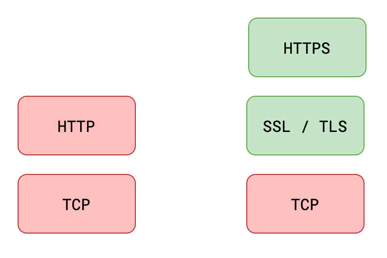

# SSL,TLS,HTTPS

[https模块](../NodeJS/Node%E6%A0%B8%E5%BF%83/https%E6%A8%A1%E5%9D%97%203320f8d8d1fd802fa70dc78522c4d37f.md) 

SSL（Secure Sockets Layer），安全套接字协议

TLS（Transport Layer Security），传输层安全性协议

**TLS是SSL的升级版，两者几乎是一样的**

HTTP**S**（Hyper Text Transfer Protocol over **SecureSocket Layer**），建立在SSL协议之上的HTTP协议

理想的，A用**非对称加密**生成 公钥1 和 私钥1 ，将 公钥1 传输给B，然后B生成一个随机密钥 KEY，用**对称加密**通过 公钥1 对 KEY 加密之后生成的 公钥2 返回给A，然后 A 对通过 密钥1 解密 公钥2 得到 KEY 那么A,B都有B生成的 KEY 后就可以高速的对称加密传输

如果第一步也就是 A的 公钥1 传给B是安全传到的，那么之后都是没问题的，问题是黑客可能在第一步就做手脚

问题就出在可信度上，所以 证书颁发机构 CA 出来了 (**Certificate Authority**) 颁发机构有自己的 公钥 和 私钥

将 第一步的公钥1、服务器地址、还有钱 给证书颁发机构，会拿到一个证书，里面有

1. **服务器地址**
2. 是哪个**证书颁发机构**
3. 通过颁发机构**私钥加密后的公钥1**
4. 通过颁发机构**私钥加密后的证书签名**

那么假如黑客还想故技重施在 公钥1 上动手脚，它没有私钥进行加密（ B 会对收到的钥匙通过证书颁发机构的公钥进行解密校验 ）

证书签名包含了 服务器地址 + CA公钥KEY + 公钥1 ，从而防止黑客更改 服务器地址、哪个证书颁发机构

有点像 JWT 的签名

所以所有证书内容都不会被篡改

需要的操作

服务器：申请证书

客户端：访问时，使用 https://xxxx

https的默认端口是443

像没有证书或被篡改、或者证书颁发机构浏览器不认可时，浏览器就会报错“当前连接不安全”

# 面试题

1. 介绍下中间人攻击
    
    > 参考答案：
    > 
    > 
    > 针对 HTTPS 攻击主要有 **SSL 劫持攻击和 SSL 剥离攻击两种**。
    > 
    > SSL **劫持攻击**是指攻击者劫持了客户端和服务器之间的连接，将服务器的合法证书替换为**伪造的证书**，从而获取客户端和服务器之间传递的信息。这种方式一般容易被用户发现，浏览器会明确的提示**证书错误**，但某些用户安全意识不强，可能会点击继续浏览，从而达到攻击目的。
    > 
    > SSL 剥离攻击是指攻击者劫持了客户端和服务器之间的连接，攻击者保持自己和服务器之间的 HTTPS 连接，但**发送给客户端普通的 HTTP 连接**
    > 
2. 介绍 HTTPS 握手过程
    
    > 参考答案：
    > 
    > 1. 客户端请求服务器，并告诉服务器自身**支持的加密算法**以及**密钥长度**等信息
    > 2. 服务器响应**公钥**和**服务器证书**
    > 3. 客户端验证**证书是否合法**，然后生成一个**会话密钥**，并用服务器的公钥加密密钥，**把加密的结果通过请求发送给服务器**
    > 4. **服务器使用私钥解密被加密的会话密钥并保存起来，然后使用会话密钥加密消息响应给客户端，表示自己已经准备就绪**
    > 5. 客户端使用会话密钥解密消息，知道了服务器已经准备就绪。
    > 6. 后续客户端和服务器使用会话密钥加密信息传递消息
3. HTTPS 握手过程中，客户端如何验证证书的合法性
    
    > 参考答案：
    > 
    > 1. 校验证书的**颁发机构**是否受客户端信任。
    > 2. 通过 **CRL** 或 **OCSP** 的方式**校验证书是否被吊销**。
    > 3. 对比**系统时间**，校验证书是否在**有效期**内。
    > 4. 校验**签名**：通过校验对方是否存在证书的私钥，判断**证书的网站域名是否与证书颁发的域名**一致。
4. 阐述 https 验证身份也就是 TSL/SSL 身份验证的过程
    
    > 参考答案：
    > 
    > 1. 客户端请求服务器，并告诉服务器自身支持的加密算法以及密钥长度等信息
    > 2. 服务器响应公钥和服务器证书
    > 3. 客户端验证证书是否合法，然后生成一个会话密钥，并用服务器的公钥加密密钥，把加密的结果通过请求发送给服务器
    > 4. 服务器使用私钥解密被加密的会话密钥并保存起来，然后使用会话密钥加密消息响应给客户端，表示自己已经准备就绪
    > 5. 客户端使用会话密钥解密消息，知道了服务器已经准备就绪。
    > 6. 后续客户端和服务器使用会话密钥加密信息传递消息
5. 为什么需要 CA 机构对证书签名
    
    > 主要是为了解决证书的**可信问题**。如果没有权威机构对证书进行签名，客户端就无法知晓证书是否是伪造的，从而增加了中间人攻击的风险，https 就变得毫无意义。
    > 
6. 如何劫持 https 的请求，提供思路
    
    > 1. 挟持攻击
    https 有防篡改的特点，只要浏览器证书验证过程是正确的，很难在用户不察觉的情况下进行攻击。但若能够更改浏览器的证书验证过程，便有机会实现 https 中间人攻击。
    > 
    > 
    > 所以，要劫持 https，首先要**伪造一个证书**，并且要**想办法让用户信任这个证书**，可以有多种方式，比如病毒、恶意软件、诱导等。一旦证书被信任后，就可以利用普通中间人攻击的方式，使用伪造的证书进行攻击。
    > 
    > 2. 剥离攻击
    >