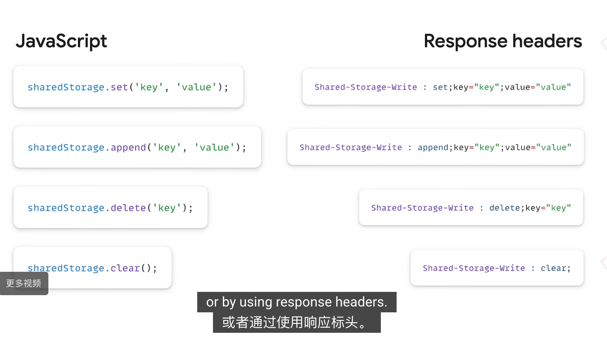

# Storage

[实践](Storage/%E5%AE%9E%E8%B7%B5%2031a0f8d8d1fd80fabdfde23f4ac94174.md)

键值对

- setItem - 增、改
- getItem - 查
- removeItem - 删

（不提供搜索功能，不能建立自定义的索引）

# localStorage

```jsx
**localStorage.setItem**('I\'m Key', 'I\'m Value');

const value = **localStorage.getItem**('I\'m Key');
console.log(value);

const userValue = {
    id: 1,
    name: 'ceilf6',
    role: 'admin'
}
// **只能存字符串，所以得 JSON.stringify / JSON.parse**
const userValueStr = JSON.stringify(userValue)
localStorage.setItem('I\'m Key', userValueStr);
const userValueParse = JSON.parse(localStorage.getItem('I\'m Key'))
console.log(userValueParse);

// localStorage.removeItem('I\'m Key');

console.log(localStorage.getItem('I\'m Key'));
```

# **sessionStorage**

API 和 localStorage 完全一致，只是换成 sessionStorage

# sharedStorage

[https://privacysandbox.google.com/private-advertising/shared-storage?utm_source=devtools&utm_campaign=stable&hl=zh-cn](https://privacysandbox.google.com/private-advertising/shared-storage?utm_source=devtools&utm_campaign=stable&hl=zh-cn)

像 Indexed DB 、 local Storage 等都从隐私安全性考虑，开启了顶层网站隔离

顶层网站隔离：any.**example.com** 和 any.**blog.com** 是不能互相访问的

Output APIs

1. Select URL
    
    A/B 测试
    
    根据次数进行个性化展示
    
2. Private Aggregation
    
    网站访问者统计等等
    

[goo.gle/shared-storage](http://goo.gle/shared-storage)

